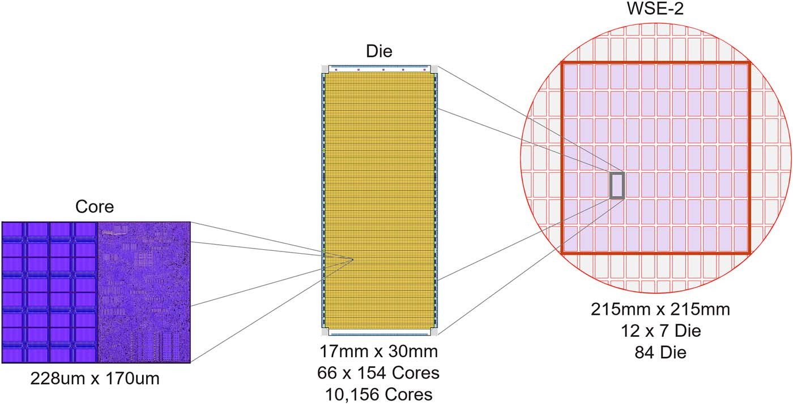
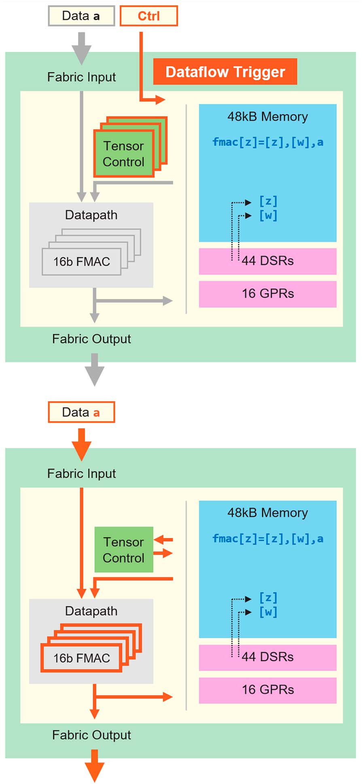
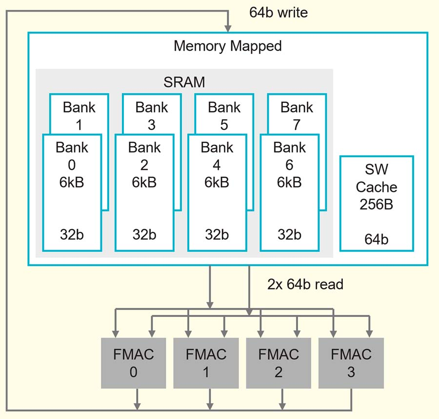
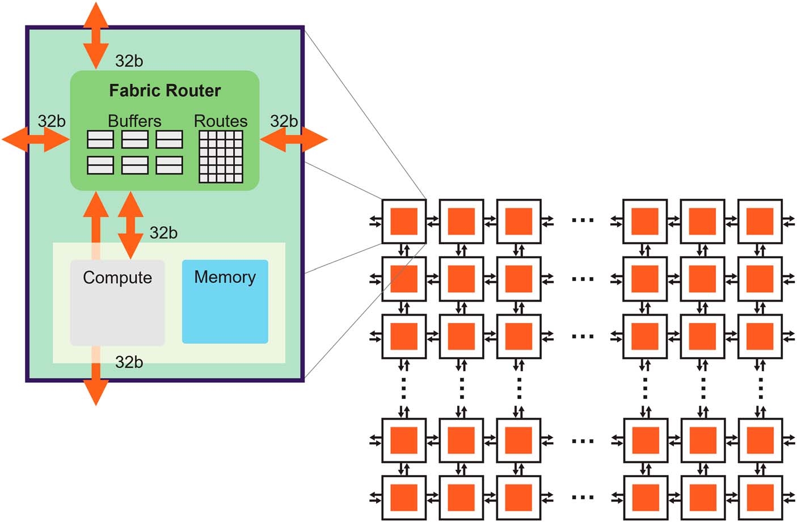
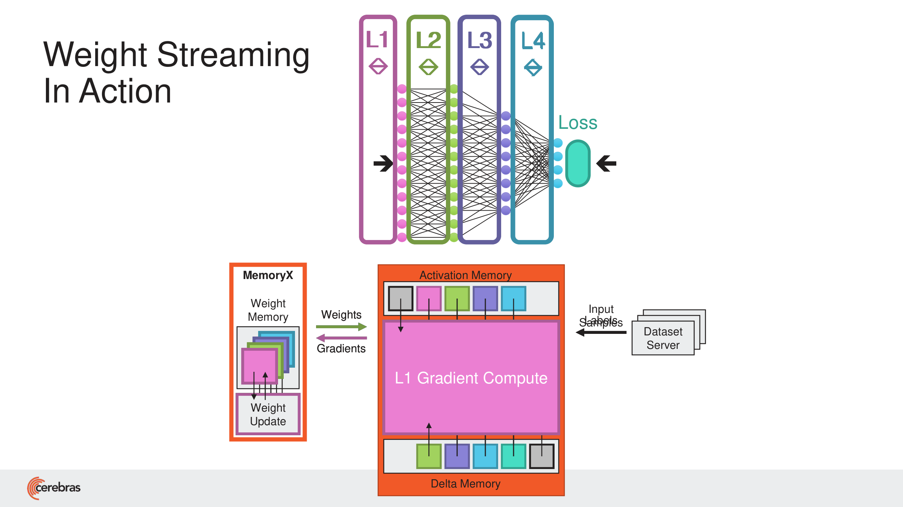
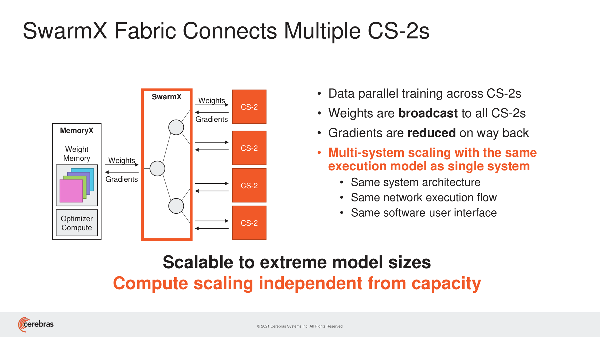
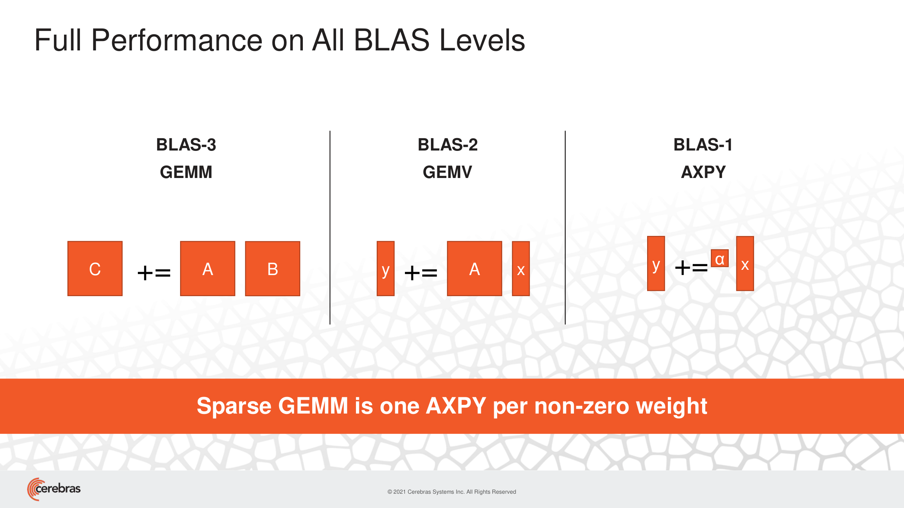
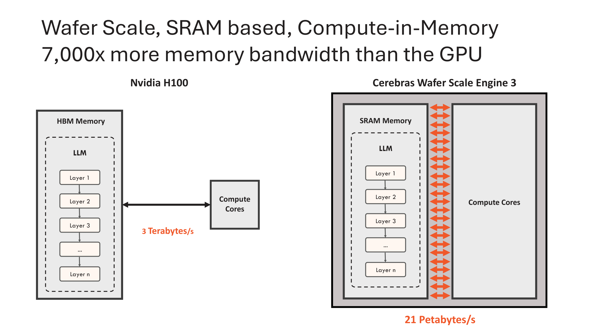

# Cerebras WSE / CS 系统

一句话定位：**不是"超大 GPU"，而是一台 wafer-scale 的 distributed-SRAM dataflow machine**——用整片晶圆上的几十万个小型可编程 dataflow core + 每 core 本地 SRAM + 静态路由 2D mesh + 权重流式输入，把传统多 GPU 系统里的 HBM 墙、模型并行复杂度和片间通信，尽量压进片上 fabric 和静态映射里。

## 关键参数（WSE-3 / CS-3）
| 项 | 值 |
|---|---|
| 工艺 / 面积 | TSMC 5nm / 46,225 mm²（整片晶圆，84 个 die 区域不切开） |
| 晶体管 | > 4 万亿 |
| core 数 | 900,000 |
| 片上 SRAM | 44 GB（每 core 48 KB，独立寻址，非 cache） |
| 算力 | 125 PFLOPS（FP16） |
| 片上 memory 带宽 | 21 PB/s |
| fabric 带宽 | 214 Pb/s |
| 单 core datapath | 8-way FP16/BF16 SIMD、16-way INT8；48 DSR；512B local cache |
| fabric | 2D mesh，5-port router，静态路由，每 core 24 colors |
| packet | 16b data + 16b control = 32b 细粒度 packet |
| 权重 | 训练时外置于 MemoryX 流式输入；推理时尽量常驻片上 SRAM |

## 执行模型：dataflow-triggered，不是 PC 顺序执行
core 不是"取指→译码→执行"的顺序处理器，而是**数据到达即触发计算**：
- core 预加载一组 handler / tensor 操作
- fabric 上的 data/control packet 到达 → 按 color/control **lookup handler** → DSR 描述的 tensor operand → datapath 执行 FMAC/AXPY → 写回本地 SRAM/accumulator 或发回 fabric
- 因此 **fabric packet 既是数据传输，也是执行事件**——整片 fabric 是一台 dataflow engine

与 Graphcore 的对比：Graphcore 更像"编译器排好的 BSP exchange machine"，Cerebras 更像"packet-triggered dataflow mesh machine"。

## core 特性
小型可编程 tensor dataflow PE，单 core 很弱、靠数量堆（WSE-2 数据：228µm×170µm，logic:SRAM = 50:50，110k cells，1.1GHz，峰值 30mW）。
- **通用底座（非重点）**：16 GPR、6-stage pipeline、arith/logic/load-store/branch；48KB SRAM 同放 data 和 instruction。作用是可编程控制底座，不是跑复杂控制流的 CPU。
- **DSR（Data Structure Register）**：硬件化的 tensor descriptor / iterator。存的不是数据，而是 tensor 的 base/length/shape/stride，以及 FIFO、circular buffer、**fabric-streaming tensor** 的描述。一条 tensor 指令 + DSR + 硬件状态机 = 自动遍历整个 tensor，把循环/地址生成从软件搬进硬件。
- **tensor 是 ISA 一等 operand**：如 `fmac [fpsum] = [fpsum], [fwd_wgt], r_in`；operand 可来自本地 SRAM，也可直接来自 fabric stream。底层仍是 SIMD datapath，但上层抽象不是 vector register 而是 DSR 描述的 tensor。
- **microthreads**：单 core 内 8 个独立 tensor context，硬件按 input/output 可用性 + 优先级 cycle-level 交错，填补稀疏/动态数据流下的 pipeline bubble（不是 GPU warp）。

## fabric
**wafer-scale static-routed dataflow NoC**：满足 NoC 定义，但不是 cache-coherent 通用 NoC，而是为 ML dataflow / weight broadcast / partial-sum reduction / sparse trigger 专门设计。
- **router**：每 core 一个，5-port（N/S/E/W + core），各方向 32b/cycle 双向，相邻 core 单周期延迟，lossless flow control + low buffering——很"瘦"，才能复制到 90 万 core
- **静态路由 + colors**：每 core 24 个 colors。color ≈ 静态 route 配置 + 独立 buffer + packet 类别 + handler dispatch tag 的混合体；比 VC 多了"编译期配置路径"和"触发计算"的语义。所有 color time-multiplex 到同一物理 link，但各自 buffer 独立（避免 head-of-line blocking）
- **collective 是一等能力**：硬件 native broadcast/multicast（权重沿途复制覆盖一列 core）；reduction 是 fabric 通路 + core tensor 指令 + PSUM/FSUM command 触发 + ring pattern（静态 color 设置），可与下一行 weight 的 FMAC overlap——不是 router 内透明 all-reduce
- **跨 die / wafer-scale 的真正难点**：84 个 die（12×7，每个 ~17mm×30mm、~10,156 core），跨 die 用 **scribe line 上 <1mm 高层金属短线** + source-synchronous parallel interface 连接，>100 万根线，靠 **冗余 + training + auto-correction 状态机** 绕过坏 link，**软件看到的是 fully uniform 2D mesh**（物理 mesh → 修复后逻辑 mesh → 编译器 route 拓扑 → 调度 dataflow，四层分离）
- **能效来源**：不是 router 多神奇，而是**物理距离短**——把很多 GPU 需要跨芯片走 SerDes/NVLink 的通信，压成 wafer 内短线（HC2022 对比同面积 sub-fabric：vs A100 约 7× 带宽、66× pJ/bit、10× 功耗优势）

## MatMul 映射：The Wafer is the MatMul Array
把整片 wafer 当成一个巨大的 MatMul 阵列。Transformer activation `[Batch, Seq, Hidden]`：
- **Hidden → x 方向**，**Batch/Seq → y 方向**；activation 常驻各 core 本地 SRAM
- weight 从边缘 broadcast 进各列 → nonzero weight 到达触发 FMAC → partial sum 经 ring reduction → 输出 layout 直接适配下一层输入（**让上一层输出分布 = 下一层输入分布，减少中间重排**）
- 单 WSE 可放下 up to 100k×100k 的 MatMul，**无需把单层切成 tensor/pipeline parallel**

![activations[B][S][H] → 整片 wafer：H 映射 x 方向，B/S 映射 y 方向](assets/matmul_array.png)

## 存储与系统扩展（训练）：存算解耦
- **MemoryX**：外置参数存储 + optimizer compute。4TB–2.4PB，可承载 200B–120T 权重 + optimizer state（DRAM + flash 混合）。**"120T 参数"是 MemoryX 的系统容量，不是片上 SRAM 容量**
- **Weight Streaming**：权重存 MemoryX、按层流入 wafer、用完即丢；activation 常驻 wafer；gradient 流回 MemoryX 做 update。靠 coarse/fine-grained pipelining 把权重流入、梯度流出、optimizer update 与计算 overlap，掩盖延迟。代价是 MemoryX 带宽必须够、依赖大 batch 摊销

- **SwarmX**：MemoryX 与各 CS 之间的 broadcast/reduce fabric（tree 拓扑）。多系统扩展只做 **data parallel**——把模型并行通信转成更规则的 broadcast/reduce

## 稀疏：架构放大器
核心等价关系：**Sparse GEMM = 每个非零 weight 一次 AXPY**。

- zero 在 **sender 端就过滤**（根本不发包），同时省下 compute / fabric traffic / 调度 / 功耗——不是 receiver 端 `if w==0 skip`
- nonzero packet 到达直接触发 FMAC，天然支持 **fine-grained unstructured sparsity**（GPU tensor core 多偏 dense 或结构化稀疏）
- 官方在 GPT-3 12k×12k MatMul 上展示稀疏度与加速接近线性
- **批判**：收益依赖算法侧——模型能否稀疏、稀疏是否保精度、nonzero 分布是否造成局部拥塞、reduction 是否成瓶颈、metadata overhead 是否可控。硬件"能高效承载稀疏" ≠ 真实模型必然拿到 10× 收益

## 芯片迭代：同一范式下的工艺/数据通路升级
| | WSE-1 / CS-1 | WSE-2 / CS-2 | WSE-3 / CS-3 |
|---|---|---|---|
| 年份 | 2019 | 2021 | 2024 |
| 工艺 | 16nm | 7nm | 5nm |
| core 数 | 400,000 | 850,000 | 900,000 |
| 晶体管 | 1.2T | 2.6T | >4T |
| 片上 SRAM | 18GB | 40GB | 44GB |
| memory BW | — | 20 PB/s | 21 PB/s |
| fabric BW | — | 220 Pb/s | 214 Pb/s |
| 单 core datapath | — | 4×FP16 FMAC，44 DSR | 8-way 16b SIMD / 16-way 8b，48 DSR |

代际不是 GPU 式架构大换代，而是**同一个 wafer-scale dataflow + distributed SRAM 范式**下加 core、加数据通路、加 SRAM、补软件与推理叙事。（注：WSE-3 fabric BW 214 < WSE-2 的 220，可能是统计口径/取整差异，不能据此判断 fabric 变弱）

## 训练 vs 推理：其实是两套叙事
读这些材料最重要的批判点——**同一硬件，两个不同的权重故事**：

| 场景 | 权重位置 | 核心瓶颈 | 方案 |
|---|---|---|---|
| 训练 | MemoryX（外置） | 大模型容量 + 分布式并行复杂度 | weight streaming + data parallel |
| 大 batch / prefill | resident 或 streaming | compute + memory | wafer-scale 并行 |
| 单用户 decode | 尽量 SRAM resident | 权重读取带宽、KV cache、串行依赖 | SRAM 带宽 + pipeline |
| 70B+ 推理 | 多 WSE resident | 跨 WSE layer/pipeline 通信 | 多 wafer 映射 |

HC2024 把叙事转向推理：生成 1000 token 要 1000 次串行过模型、每次都读权重，故 memory bandwidth 是瓶颈。WSE-3 的 44GB SRAM 能放下 Llama3.1-8B FP16；70B（140GB FP16）需 4×WSE-3 的 176GB SRAM 承载。WSE-3 vs H100 的极端对比（约 57× 面积、880× 片上内存、7000× memory 带宽）是营销口径，但点出推理路线核心：**把权重放进 wafer SRAM，避免每 token 从 HBM 读**。
> 训练叙事自洽；推理叙事吸引人但有条件——能否成立取决于模型/KV cache 是否真能塞进聚合 SRAM，以及 batch、延迟、吞吐、系统成本的具体权衡。

## 融资和经营情况
- 2016 年 3 月成立（Andrew Feldman + Gary Lauterbach、Michael James、Sean Lie、Jean-Philippe Fricker）；2019 年 8 月发布 WSE-1 / CS-1
- 营收高速增长：2022 **$24.6M** → 2023 **$78.7M** → 2024 **$290.3M** → 2025 **$510M**
- **客户极度集中**：G42（阿联酋）占 2024 营收 85%；2025 降至 24%，但另一阿联酋客户 MBZUAI 又占 62%——集中风险只是换了对象。截至 2024 底单一客户（G42）占应收账款 91%
- CFIUS 审查：2025 年 3 月通过，条件是把 G42 的股权改为无投票权、移出治理
- **IPO**：2026 年 5 月登陆 Nasdaq（CBRS），估值约 **$230 亿**，募资约 **$55.5 亿**（Snowflake 以来美国最大科技 IPO 之一）
- OpenAI 协议：750MW 推理容量、2030 年前可扩至 2GW，满额价值 >$200 亿
- **盈利质量存疑**：2025 报告净利 $237.8M，但几乎全来自 G42 forward 合约重组的 $363M 一次性会计收益；non-GAAP 净亏 $75.7M，较 2024 的 $21.8M 反而扩大

## 从中该获取的经验教训

### Cerebras 的下注
- **scale-up first**：与其用 chiplet/HBM/NVLink 做 scale-out，不如把整片晶圆做成一颗逻辑芯片，把片间通信压进 wafer 内
- **distributed SRAM 替代 HBM resident execution**：memory 贴着 compute 放，靠 aggregate SRAM 带宽吃低复用/稀疏/decode workload
- **存算解耦 + data-parallel-only**：MemoryX 管容量、WSE 管单层计算、SwarmX 管广播归约，把分布式并行复杂度前移到编译器和系统架构

### 与 Graphcore 的关键差异（为什么活法不同）
两者都反 GPU 的 cache-HBM 路线、都把复杂性转移给编译器，但 Cerebras 走得更极端（wafer-scale）。差别在于**时机和需求**：
- Graphcore 赌"未来稀疏/图结构"赌错了，且没接住任何需求浪潮；Cerebras 同样押稀疏，但**赶上了"快速推理"这条真实需求曲线**，并拿到了财力雄厚的 anchor 客户（G42/中东主权资金）和 OpenAI 这种标杆订单
- 但 Cerebras 的客户集中度（G42→MBZUAI，长期 80%+ 来自中东）本质上和 Graphcore 依赖微软是同一类风险——**anchor customer 既是救命稻草也是单点故障**

### 该警惕的点（批判）
- **盈利是会计驱动而非经营驱动**：一次性收益撑起的净利，掩盖了仍在扩大的经营性亏损
- **wafer-scale 的固有代价**：良率、散热、整片不可分割带来的成本/封装/维修复杂度，是长期性价比的问号
- **强依赖编译器静态映射**：没有共享内存幻觉，tensor layout 与物理拓扑强绑定，mapping 错了 fabric 再强也被远距离搬运/重排拖垮；静态路由对动态 shape / 动态通信不友好
- **稀疏收益依赖算法侧兑现**，不是硬件自动达成
- **灵活性 vs 通用性**：用通用动态性，换 wafer-scale 上可静态规划、低开销、高带宽的数据流执行——这条路在"workload 规则、可静态映射"时极强，越动态越吃亏

---
*本文基于 raw/ 下官方资料（WSE-3 白皮书、HC2021/2022/2024）与对应 chat 梳理；经营/上市数据来自公开报道（截至 2026-06）。架构图取自官方幻灯片：`data_path`/`SRAM`/`fabric`/`wafer_scale_engine` 来自 HC2022，`weight_streaming`/`swarmx`/`sparse_axpy` 来自 HC2021，`matmul_array` 来自 HC2022，`memory_wall` 来自 HC2024。*
