# Graphcore IPU Programmer's Guide Wiki

> 来源：`raw/docs-graphcore-ai-ipu-programmers-guide-en-latest.pdf`  
> 文档：Graphcore Ltd, *IPU Programmer's Guide*, version latest, 2023-10-10

## 1. 核心结论

Graphcore IPU 是面向机器学习和人工智能 workload 的高度并行处理器。它的关键设计不是传统 GPU 式的 SIMT 大核阵列，也不是单一矩阵阵列，而是由大量独立 tile 构成的分布式计算系统。每个 tile 有自己的处理器、本地 SRAM 和独立地址空间；tile 之间通过 exchange fabric 做显式数据交换。

IPU 的编程和执行模型可以概括为：

```text
模型/算法图
  -> Poplar graph
  -> 变量映射到 tile / Streaming Memory
  -> compute set / vertex / codelet
  -> BSP: compute -> sync -> exchange
  -> per-tile 程序
```

理解 IPU 时最重要的几个点：

- **分布式片上 SRAM 是一等存储**：In-Processor-Memory 由每个 tile 的本地 SRAM 组成，访问快但地址空间彼此隔离。
- **外部 DRAM 是 Streaming Memory**：tile 不能直接 load/store 到 Streaming Memory，必须通过显式数据移动。
- **执行模型是 BSP**：tile 本地 compute，随后全局同步，再通过 exchange fabric 交换数据。
- **IPU 不是 SIMD 设备**：全局控制流一致，但每个 tile/thread 在同步点之间可以执行不同代码。
- **编译器责任很重**：Poplar 需要把全局程序 lowering 成每个 tile 的本地程序、同步点和通信例程。
- **算法需要围绕存储和流水线组织**：replication、gradient accumulation、recomputation、model parallel pipeline 都是 IPU 上的常见性能/容量技术。

## 2. 系统与硬件架构

### 2.1 IPU 系统组织

IPU 系统通常由 host 和一个或多个 IPU 组成。host 负责编译、加载和启动 IPU 程序；IPU 负责执行计算任务，并通过 host/device 通信通道读写训练数据、结果或其他外部数据。

Graphcore 的 IPU-Machine 是一个包含多个 IPU 和外部内存的计算平台。多个 IPU-Machine 可以进一步组成更大的 Pod 系统。多个 IPU 之间通过 IPU-Fabric 互连，其中包括 IPU-Link、GW-Link 和 IPU-Gateway 等连接机制。

一个 IPU 内部由大量 **tile** 构成。所有 tile 连接到一个高速、全互连风格的 **exchange fabric**。当多个 IPU 一起执行同一个程序时，exchange fabric 的通信范围可以扩展到多个 IPU 上的 tile。

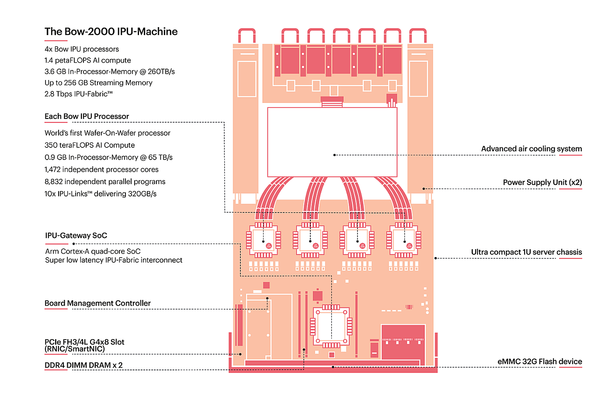

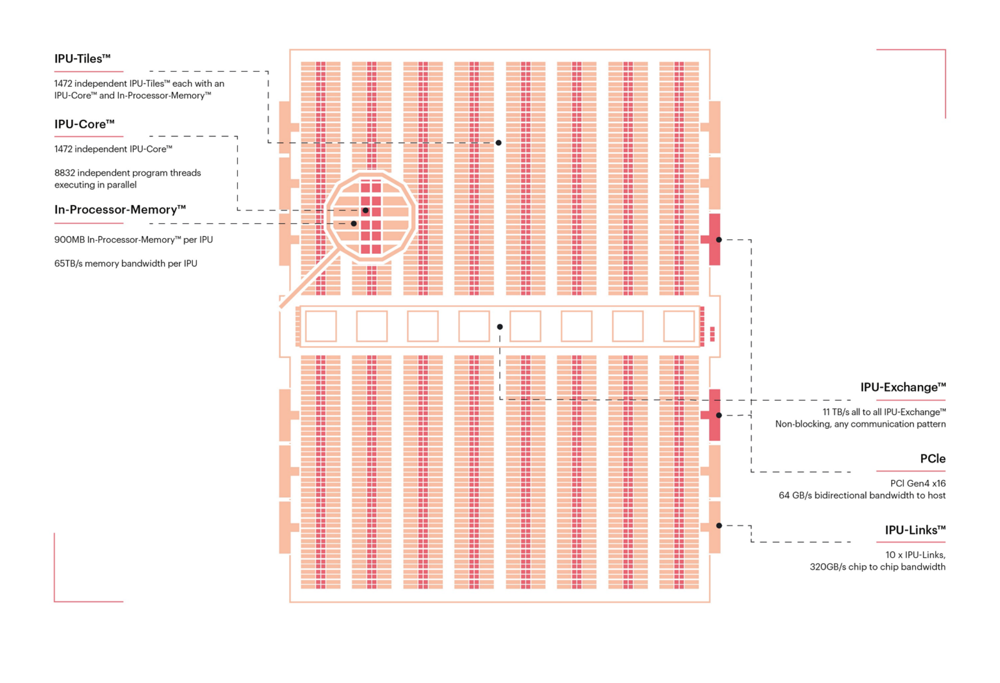

### 2.2 存储架构

IPU 机器中的存储分为两类：

| 存储 | 位置 | 访问方式 | 作用 |
| --- | --- | --- | --- |
| In-Processor-Memory | IPU 内部，本地 SRAM | tile 只能直接访问自己的本地 SRAM | 高带宽、低延迟、承载代码和主要工作集 |
| Streaming Memory | 外部 DDR | tile 不能直接 load/store，需显式 copy | 更大容量的数据存储 |

In-Processor-Memory 被拆成多个互不共享的 memory unit，每个 tile 一个。每个 tile 的 load/store 指令只能访问本 tile 的本地内存。代码也保存在本地 tile memory 中，tile 只执行本地 memory 中的代码。

Streaming Memory 由多个 DDR 芯片组成。它不是 tile 的直接地址空间。tile 和 Streaming Memory 之间的数据搬运通过显式数据移动指令完成，并使用 exchange fabric。

这个设计的含义是：

- IPU 没有一个所有 tile 都能直接访问的统一内存。
- 数据放在哪个 tile 上，是程序和编译器必须关心的问题。
- 跨 tile 数据依赖会变成显式 exchange。
- Streaming Memory 更像容量扩展层，而不是 GPU HBM 那样的主工作存储。

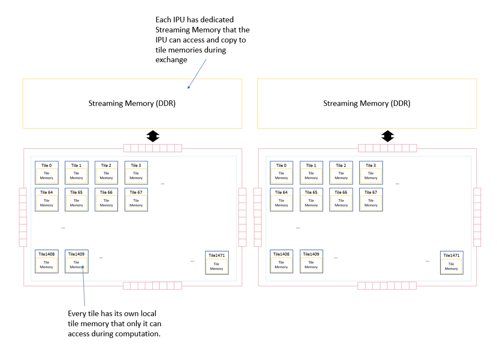

### 2.3 BSP 执行模型

IPU 使用 Bulk Synchronous Parallel 模型。一个任务会被拆成多个 step，每个 step 包含：

```text
local tile compute
global cross-tile synchronisation
data exchange
```

在 compute 阶段，所有 tile 并行执行，只访问各自本地数据。tile 完成本地计算后进入同步。所有 tile 同步完成后，进入 exchange 阶段，tile 之间或 tile 与 Streaming Memory 之间执行数据搬运。之后继续下一轮 compute。

可以把 IPU 的主执行节奏理解为：

```text
repeat:
  compute on local tile memory
  sync all participating tiles
  exchange data through fabric
```

这个模型的架构意义很明确：计算和通信被分成阶段，通信是可编译、可调度、可分析的显式行为，而不是被隐藏在 cache miss 或动态内存系统之后。

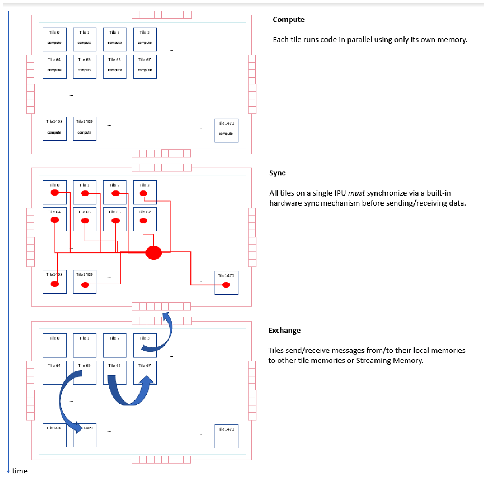


### 2.4 Tile 架构

每个 tile 包含一个多线程处理器和本地 SRAM。tile processor 有两种模式：

- **supervisor mode**：运行 tile 的顶层控制程序，可以调度 worker。
- **worker mode**：执行具体任务，任务完成后线程释放。

线程以固定顺序 round-robin 执行。worker 指令集面向机器学习 workload 设计，包含：

- 控制流指令；
- 内存访问指令；
- integer 和 floating-point 算术；
- FP32 和 FP16 运算；
- 小向量宽度的向量化操作；
- AMP accumulating matrix product unit，每 tile 每周期最高可执行 64 个 MAC；
- 常用 transcendental 函数指令；
- 随机数生成指令；
- 与浮点单元连接的硬件 stochastic rounding。

IPU 不是 SIMD 的关键也体现在这里：每个 tile processor 有独立控制流，tile 间只在显式同步点对齐。

### 2.5 On-Tile Memory 细节

以 GC200 为例，每个 tile 有 624 KB SRAM。1472 个 tile 合计接近 900 MB In-Processor-Memory。

每个 tile 使用连续的 21-bit unsigned address space。实际可用内存区域只占其中一部分。tile memory 分成两个 region，每个 region 由多个 64-bit wide bank 构成。不同 bank 可以并发访问，同一 bank 的多次访问需要串行。

Region 1 的 bank 采用交错组织，地址 bit 3 选择奇偶 bank。这允许某些相隔奇数个 64-bit word 的 64-bit aligned 地址并行访问，因此可以支持 128-bit load。所有 load/store 都需要自然对齐。指令只能从 region 0 fetch。

这些细节对性能建模有价值：tile 内部并不是一个抽象的均匀 SRAM，bank conflict、alignment 和 code/data placement 都可能影响效率。

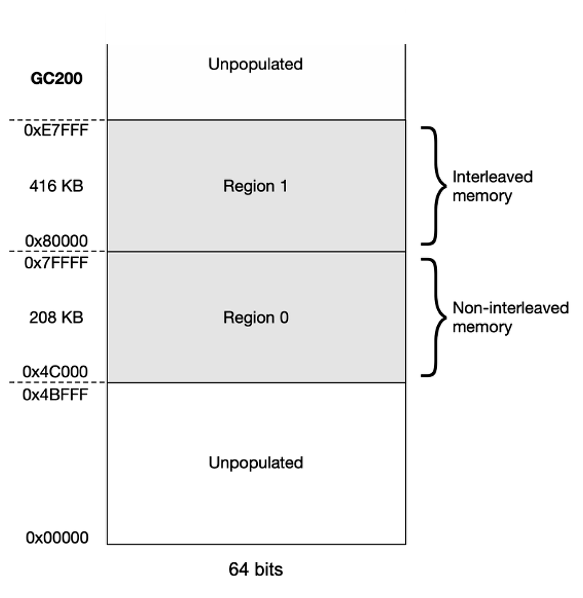

### 2.6 Host/Device 通信

IPU 可以与 host memory 交换数据。在 IPU-Machine 中，host 和 IPU 之间通过 Ethernet 上的 RDMA 实现：

```text
host memory
  <-> host RDMA NIC
  <-> Ethernet
  <-> IPU-Machine RDMA NIC
  <-> DDR / Streaming Memory
  <-> IPU exchange phase
  <-> tile memory
```

IPU 通过 exchange phase 从 DDR 读写数据。也就是说，host 数据不会魔法般直接进入 tile 本地内存，仍然要经过 Streaming Memory 和显式交换路径。

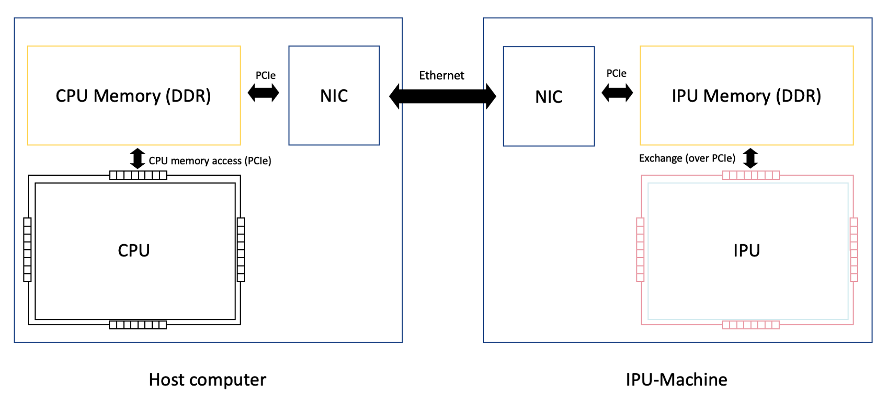

## 3. Poplar 编程模型

### 3.1 Poplar Graph Library

IPU 的抽象编程模型由 Poplar graph library (`libpoplar`) 实现。Poplar API 用于构建 IPU 程序、编译程序并在 IPU device 上运行。

高层 ML 框架如 TensorFlow、PyTorch、Keras、PopART 可以生成或导入计算图，然后通过 Graphcore 软件栈 lowering 到 IPU 程序。开发者也可以直接使用 C++ Poplar API 构建程序。

### 3.2 Program

一个 IPU program 运行在用户选择的一组 IPU 上。这组 IPU 在编译前确定，执行期间不会变化。

程序在概念上是跨所有选中 IPU 的一个全局程序：它有控制流、变量和操作。但在机器级别，它不是把同一条指令广播给所有 tile。全局程序会在同步点上对齐，在同步点之间不同 tile/thread 可以执行不同 codelet。

程序主要操作大数组或 tensor，这些数据分布在 IPU tile memory 和 Streaming Memory 中。计算由大量并行任务完成，这些任务称为 **vertices**，一组 vertex 组成一个 **compute set**。

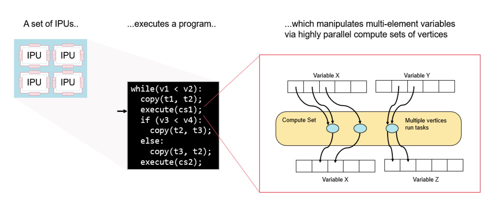

### 3.3 Variable、Tensor 与 Tile Mapping

变量是程序执行期间保存数据的对象。一个变量可以是固定大小的 typed array，例如 1024 个 FP32 元素。

变量可以跨多个 tile 存储。每个变量元素会被映射到某个具体 tile，这称为 **tile mapping**。

变量具有全局作用域，程序任何位置都可以读写。但底层物理内存可以被不同生命周期的变量复用。编译器会根据 liveness 分析让不同时 live 的变量共享 tile memory 或 Streaming Memory 地址。

在 ML 程序中，tensor 是底层 variable 的视图。多个 tensor view 可以引用同一个 variable，例如把同一块矩阵数据看成 row-major 或 column-major。Poplar 提供 slicing、transpose、concatenation 等 tensor view 操作。真正的数据移动发生在 copy 或 compute set 执行时。

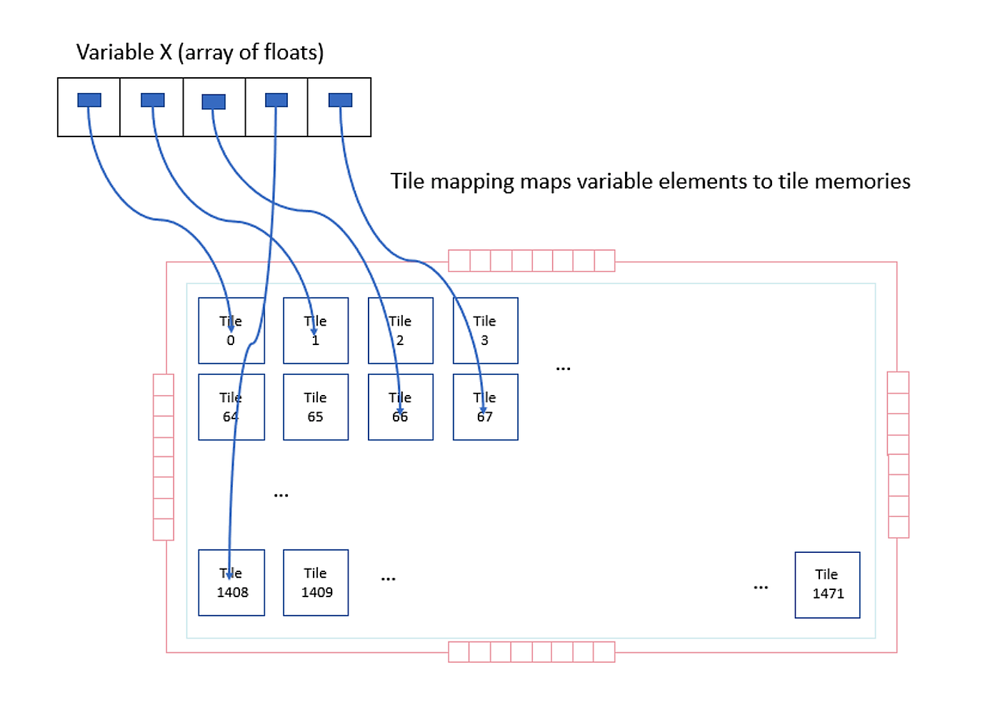

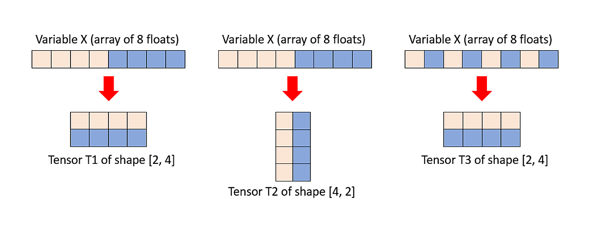

### 3.4 Copy 与 Compute Set

IPU 程序主要通过两类操作修改变量：

```text
Copy(source, destination)
Execute(computeSet)
```

Copy 可以是简单变量复制，也可以通过 tensor view 实现固定模式的数据重排。例如从 transpose view 复制到另一个变量时，会实际执行转置式的数据搬运。

Compute set 是并行计算单元。一个 compute set 包含多个 vertex。每个 vertex 固定绑定到某个 tile，运行一小段称为 **codelet** 的代码，读写自己连接的变量元素。

需要注意：某个 compute set 访问的变量元素集合在编译期是固定的，不能每次执行时动态改变。

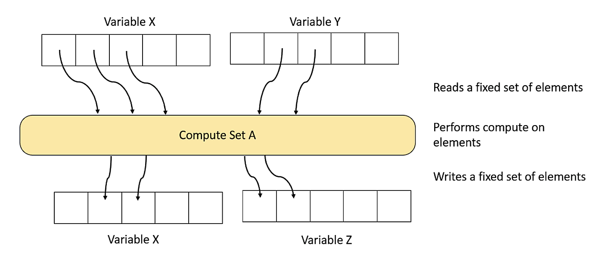

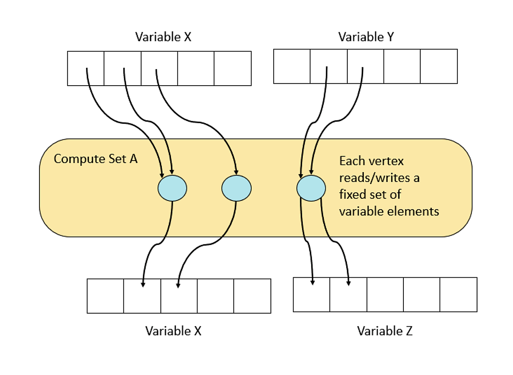

### 3.5 Control Flow

IPU 程序支持标准控制流，包括 sequence、condition、loop。用于控制流的变量通常是 size 为 1 的 tensor，也就是 scalar。

全局控制流在概念上应用到所有 IPU，但每个 tile 的本地代码和 vertex 计算可以独立。换句话说，program control 是全局组织，vertex execution 是局部并行。

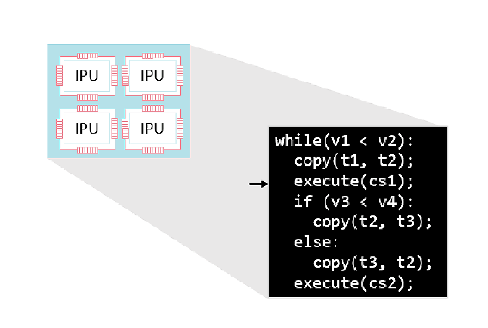

### 3.6 Computational Graph

多个 compute set 中的 vertices 和 variables 共同构成程序的 computational graph。这个 graph 显式记录 compute 和 data 的关系，但不直接表示程序控制流。

这一区分很重要：

- computational graph 表示数据依赖；
- program 表示执行顺序和控制流；
- lowering 后的 per-tile program 表示具体硬件执行。

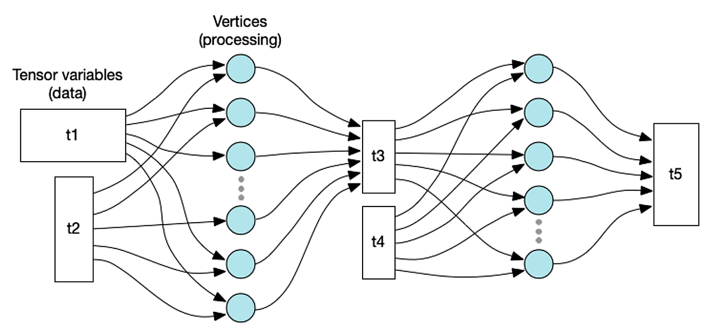

### 3.7 Data Stream

Data stream 是 IPU 程序连接外部数据的机制，通常用于从 host memory 读入数据，或把结果写回 host。

host 在程序执行前配置 data stream 的来源或处理器。data stream copy 往往会经过 host memory、Streaming Memory、IPU exchange 等多个层次，因此 Poplar/框架提供 prefetch、overlap 等优化选项。

### 3.8 IPU-Level Task Parallelism

除了 compute set 内的细粒度并行，IPU 程序还支持 fork-join 风格的任务并行。由于同步粒度通常是 IPU 内所有 tile，子程序并行的自然粒度是不同 IPU。

这种能力常用于 pipeline model parallelism。文档还描述了一种 IPU 内部有限形式的 I/O overlap：把 IPU tile 分为 I/O tile group 和 compute tile group，一个子程序专门做 data stream 或 Streaming Memory copy，另一个子程序做常规计算。

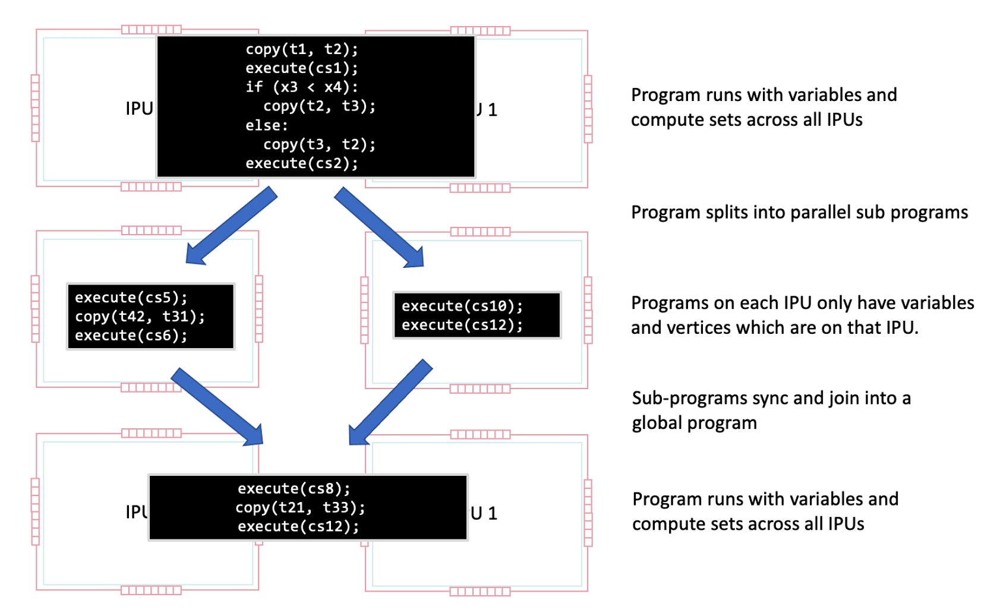

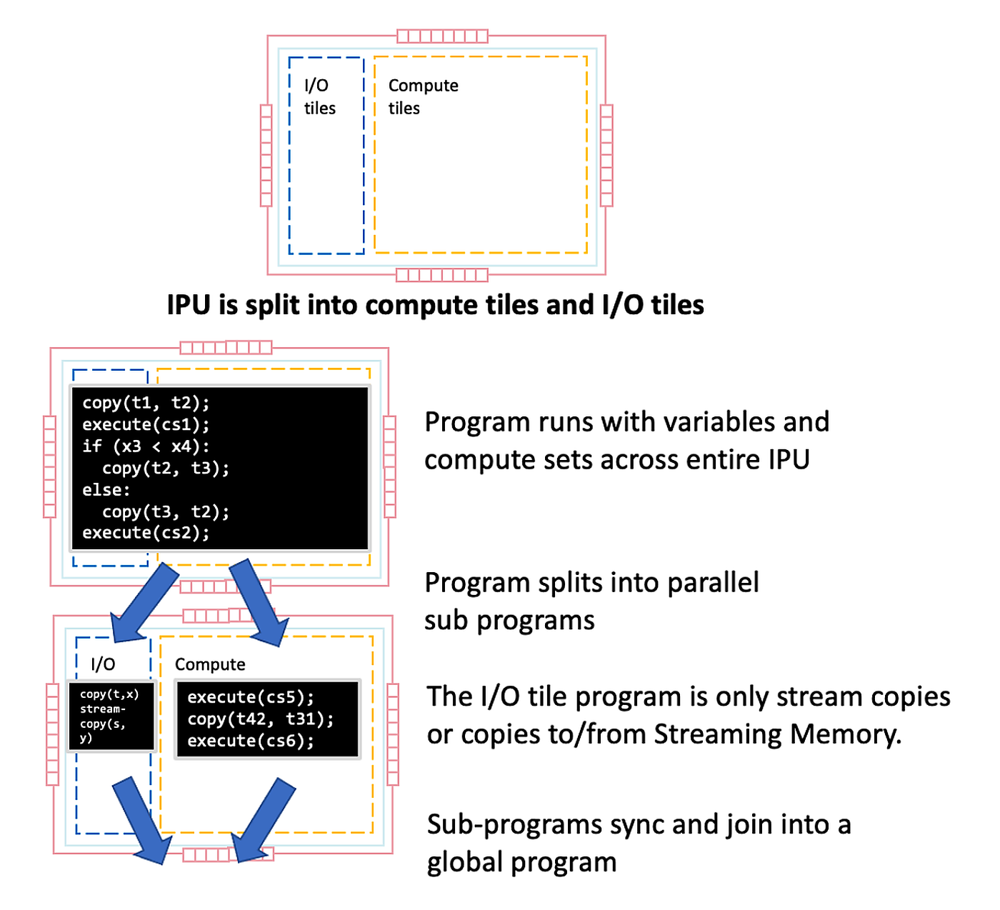

## 4. 编译与执行链路

### 4.1 Host 负责构建、编译、加载和启动

多 IPU device 总是由 host 控制。典型流程：

```text
host application
  -> construct programs
  -> compile programs into binary
  -> load binary onto IPUs
  -> configure data streams
  -> select and run a program
```

程序加载后，host 可以指示 IPU 运行某个控制程序。执行期间，IPU 可以通过 data stream 读取训练数据或写回结果。

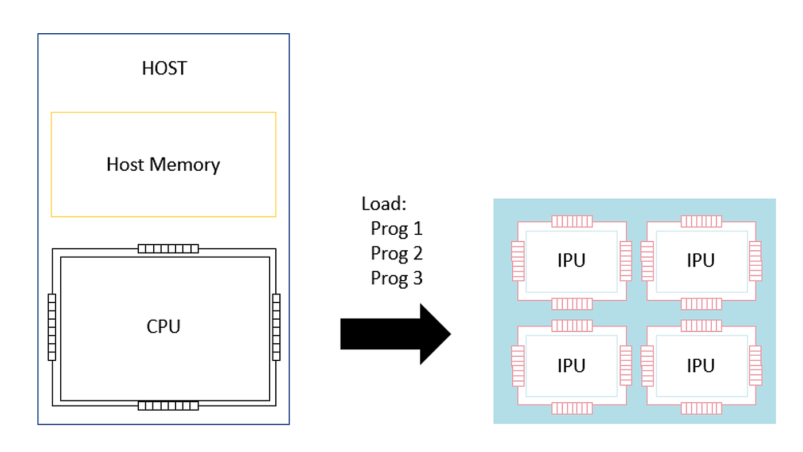

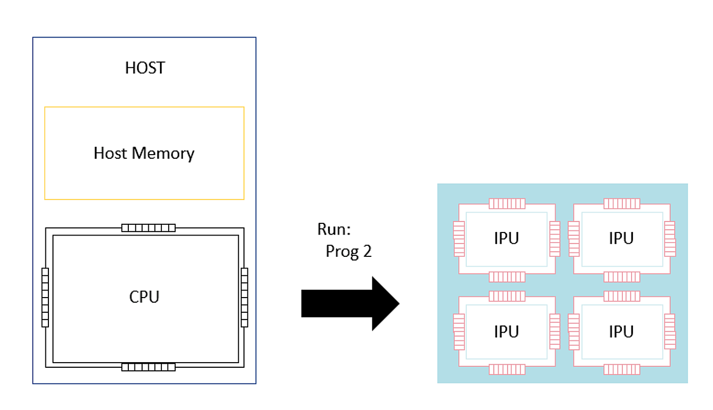

### 4.2 从 ML 框架到 IPU Program

高层 ML 框架通常先构建模型计算图，然后执行：

```text
framework graph
  -> graph transformations
  -> add backward pass
  -> add optimizer loop
  -> schedule graph nodes
  -> translate scheduled nodes to compute sets
  -> IPU program
```

每个框架节点最终会被替换成一个或多个 compute set 的执行。

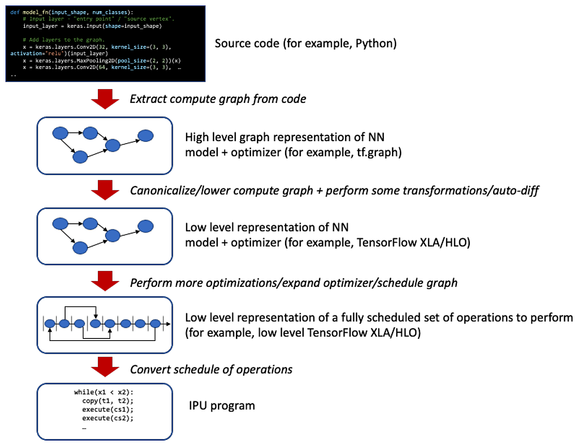

### 4.3 Lowering 到 BSP 和 Per-Tile Program

IPU 没有跨 tile 的共享内存，因此不能把全局程序直接交给传统编译器。Poplar 会先把程序 lowering 成符合 IPU chip execution 的形式，也就是显式的：

```text
sync
exchange
compute
```

然后再 lowering 成每个 tile 自己的程序。每个 tile 程序具有以下特征：

- 只读写本 tile memory；
- 包含显式同步指令；
- 包含与其他 tile 交换数据的通信例程；
- 执行 compute set 时只运行映射到本 tile 的 vertices；
- 最后可由常规编译器编译为 tile 上执行的代码。

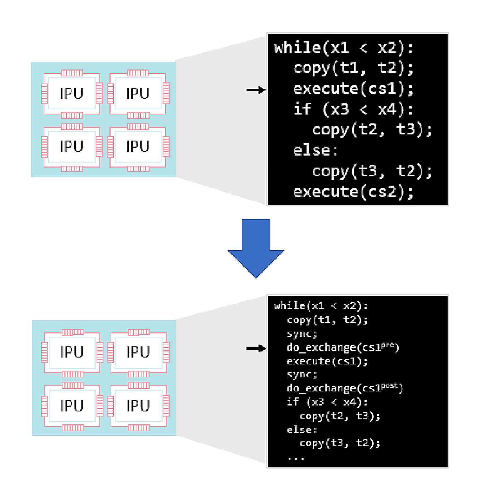

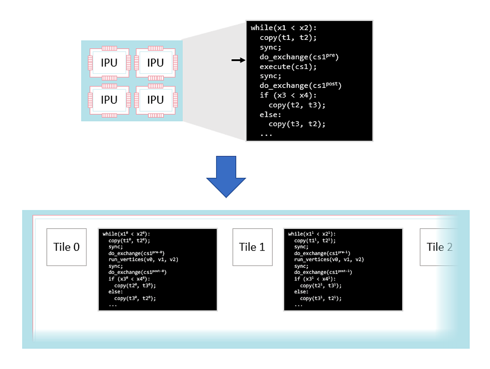

### 4.4 Variable Liveness 与内存复用

IPU 程序中的变量在抽象层面都是全局变量，但物理内存地址不一定唯一。编译器知道每个 step 的输入和输出，也知道变量在哪些执行点 live，因此可以把生命周期不重叠的变量放到相同内存地址。

这相当于在静态编译阶段做了 memory heap 优化。PopVision Graph Analyser 可以展示程序执行过程中的 live memory 和 always live memory。

对架构和性能分析而言，peak live memory 比“变量总大小”更接近真实容量压力。

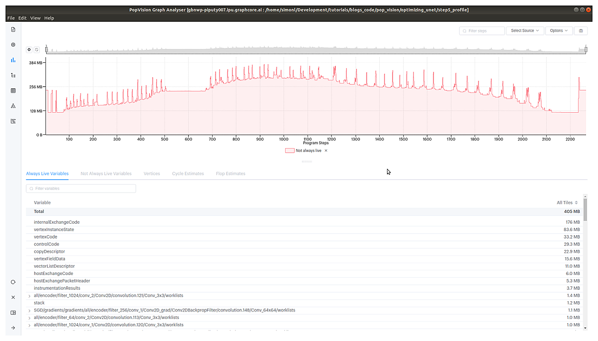

## 5. 编程工具栈

Graphcore Poplar software stack 支持多个抽象层级：

| 层级 | 工具/接口 | 用途 |
| --- | --- | --- |
| ML framework | TensorFlow, PyTorch, Keras | 尽量保持现有模型代码，增加 IPU 配置和优化 |
| ONNX / IPU framework | PopART | 导入 ONNX 或编写 IPU 优化模型 |
| Direct programming | Poplar C++ API | 直接构建 graph、variable、compute set、program |
| Libraries | PopLibs | 线性代数、elementwise、non-linearity、reduction 等预定义算子 |
| Custom op | Poplar-backed operator | 给 TensorFlow/PyTorch 添加 IPU 特化操作 |
| Profiling | PopVision Graph Analyser / System Analyser | 分析内存、执行时间、host/IPU 通信事件 |
| Multi-process launch | PopRun / PopDist | 多 replica、多 host 运行配置 |

无论通过 ML 框架还是直接 Poplar 编程，IPU 程序都会完整编译。大型程序的编译可能需要数分钟，因此工程流程中通常会缓存 compiled program，避免重复编译。

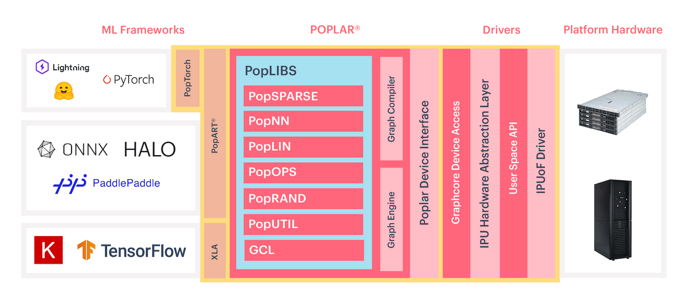

## 6. IPU 常见算法技术

### 6.1 Replication

Replication 是把同一个程序并行运行在多组 IPU 上。一个 program 本身可以跨多个 IPU，例如一个 4-IPU program 可以复制 4 份，总共使用 16 个 IPU。

replica 之间仍然通过 IPU-Fabric 连接，可以使用 collective operation 通信。例如 AllReduce 可以把每个 replica 上的 tensor 求和，然后把结果分发回所有 replica。

Replication 通常用于 data parallelism：

- 每个 replica 运行相同模型；
- 每个 replica 接收不同输入数据；
- training 时通过 AllReduce 聚合梯度；
- inference 时每个 replica 独立处理不同请求或 batch slice。

每个 replica 有自己的 replica ID，程序可以根据 ID 做行为选择。

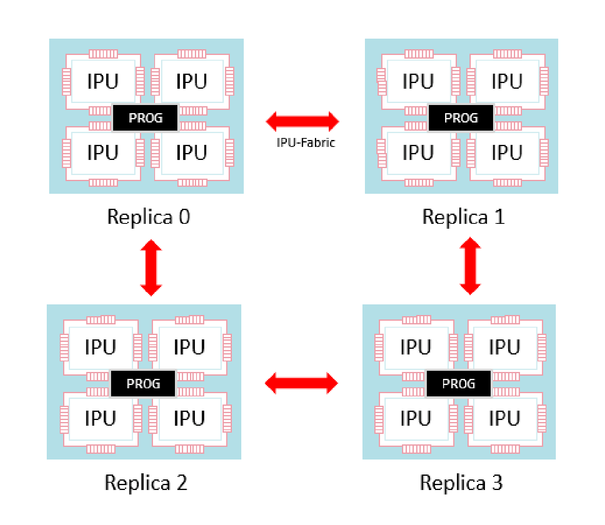

### 6.2 Replication in Training

数据并行训练的基本形式：

```text
repeat:
  forward pass on local batch
  backward pass to compute gradients
  AllReduce gradients across replicas
  update weights with aggregated gradients
```

如果所有 replica 初始权重相同，并且每次更新都使用相同聚合梯度，那么所有 replica 的权重会保持一致。训练结束后，从任意 replica 提取权重即可。

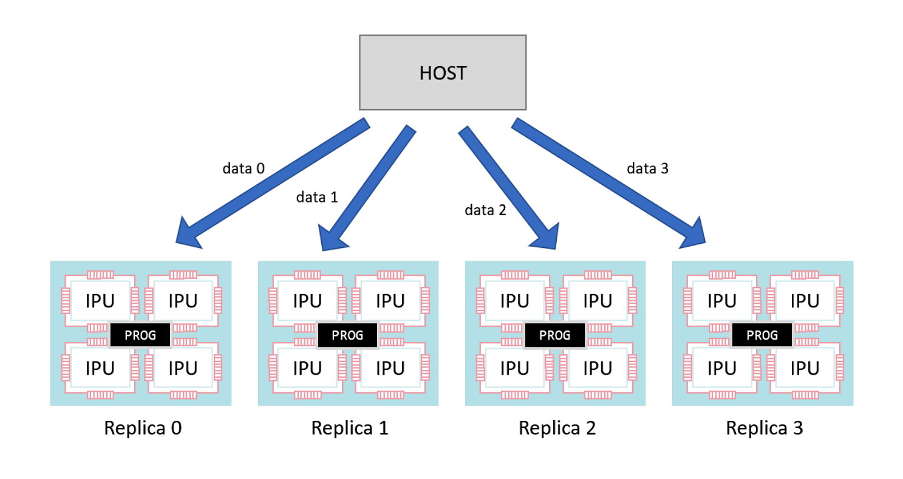

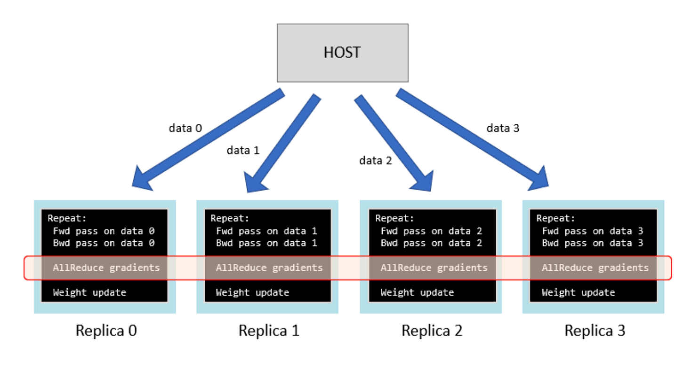

### 6.3 Replication in Inference

推理中的 replication 更直接：每个 replica 跑同一份 inference program，但处理不同输入数据。replica 之间通常不需要频繁通信。

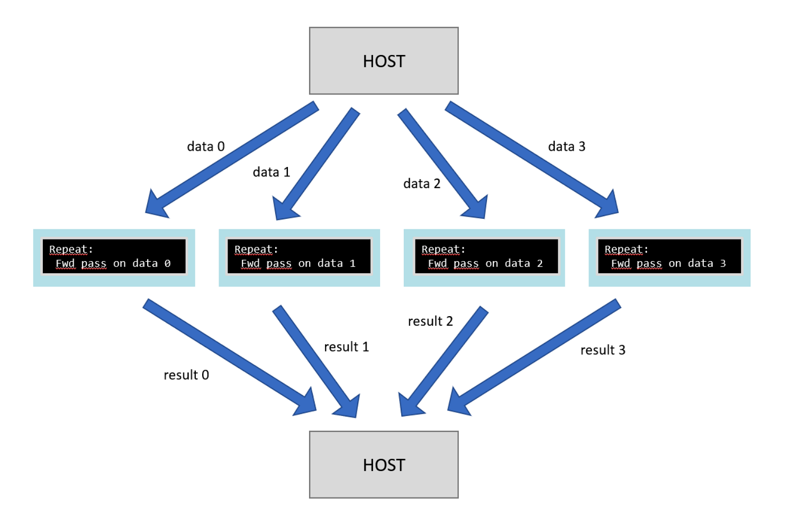

### 6.4 Multi-Host / Multi-Process

一个大规模 replica 集合可以由多个 host process 管理。每个 process 连接到 replica 子集。PopDist 用于配置每个 process 与 replica 的关系；PopRun 可以作为轻量级多 host process launcher。

这使 IPU 系统可以扩展到大量 IPU，同时保持每个 host process 的管理范围可控。

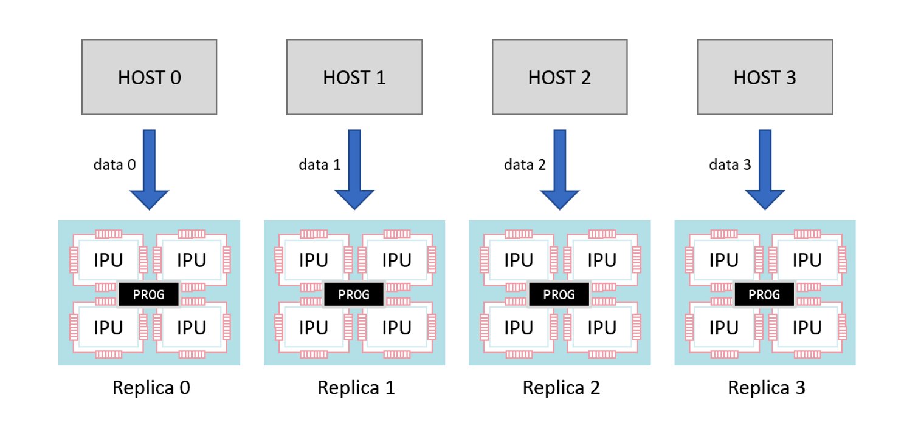

### 6.5 Replicated Tensor Sharding

Replicated tensor sharding 用于减少 replica 上的内存占用。当每个 replica 都需要同一份 tensor 时，可以把 tensor 分片保存在不同 replica 的 memory 中。使用时通过 AllGather 临时拼回完整 tensor 并广播给所有 replica。

这是一种容量和性能权衡：

- 优点：完整 tensor 不需要长期驻留在每个 replica；
- 缺点：使用前需要 AllGather，增加通信和延迟。

在 data-parallel training 中，weights 和 optimizer state 往往在 replica 间相同，因此适合这种技术。

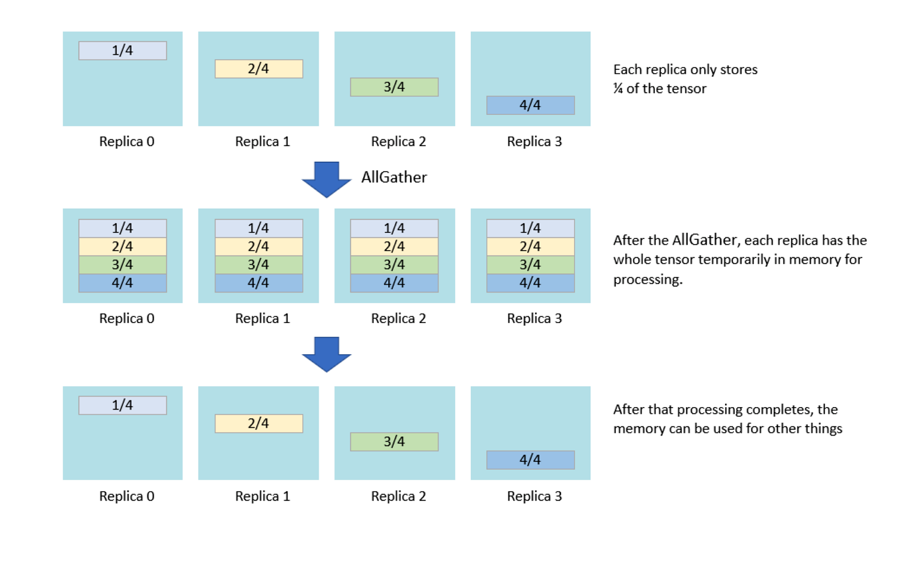

### 6.6 Gradient Accumulation

Gradient accumulation 是用多个小 batch 累积梯度，再执行一次 optimizer update。

```text
repeat:
  zero accumulated gradients
  for N iterations:
    forward pass on micro batch
    backward pass to compute current gradients
    add current gradients to accumulated gradients
  update weights with accumulated gradients
```

它的作用：

- 用较小 micro batch 模拟更大 batch；
- 减少 weight update 频率；
- 在 data parallelism 中摊薄 replicated AllReduce 开销；
- 在 pipeline model parallelism 中摊薄 pipeline ramp-up / ramp-down 开销。

### 6.7 Recomputation

训练时 forward pass 产生的 activations 通常需要保存到 backward pass。Recomputation 的思想是只保存部分 checkpoint activation，backward pass 需要中间 activation 时重新计算。

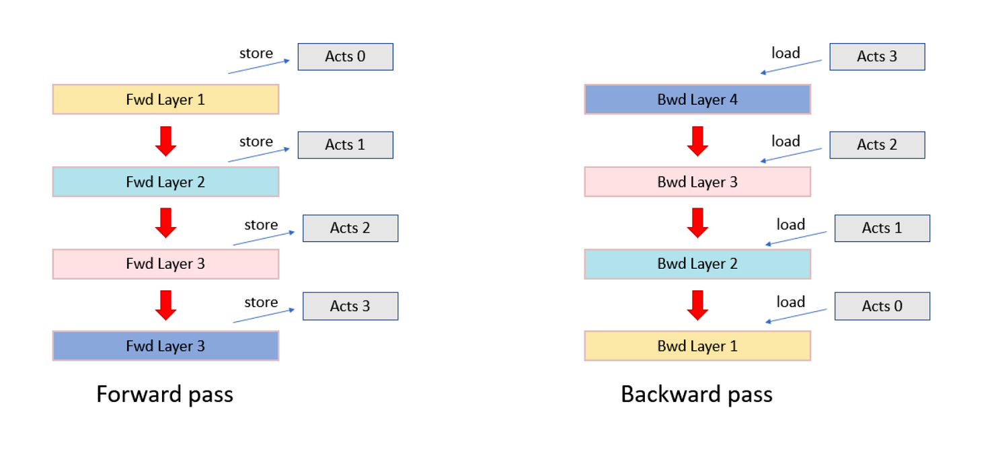

权衡：

- 优点：显著降低 activation memory；
- 缺点：增加额外 compute；
- 常与 pipeline model parallelism 一起使用。

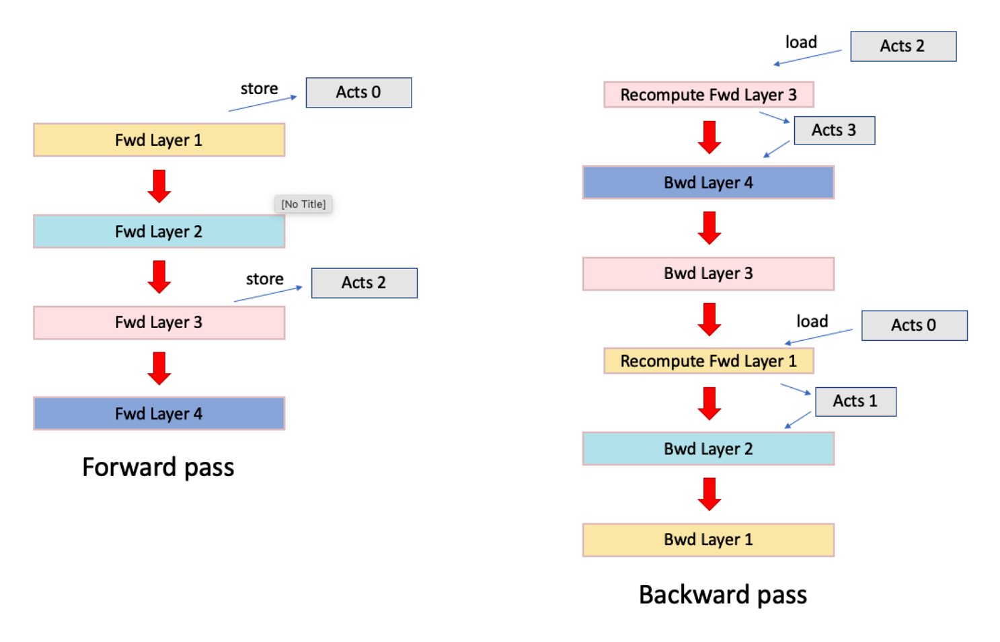

### 6.8 Model Parallelism 与 Pipeline

IPU 上常见做法是把一个模型拆到多个 IPU 上，每个 IPU 运行模型的一部分。这属于 model parallelism。文档中特别指出，模型拆分使用的 IPU 数量必须是 2 的幂。

Pipeline 的基本步骤：

1. 按 layer 或 layer group 把模型拆成多个 pipeline stage；
2. 每个 stage 放到不同 IPU；
3. batch 被拆成多个 micro batch；
4. micro batch 依次流过 pipeline；
5. training 时 backward pass 反向流过 pipeline；
6. 多个 micro batch 的梯度通过 gradient accumulation 聚合后再更新权重。

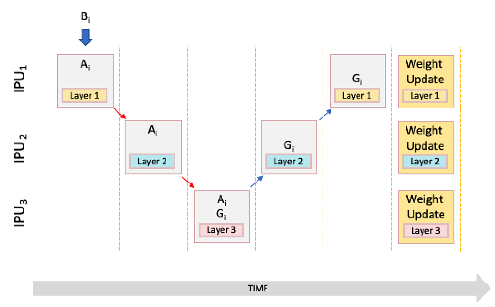

简单 pipeline 虽然能利用多 IPU memory，但如果一次只有一个 micro batch 在跑，计算利用率很低。高效 pipeline 会让多个 micro batch 同时处于不同 stage：

```text
time 0: IPU1 handles micro batch 1
time 1: IPU1 handles micro batch 2, IPU2 handles micro batch 1
time 2: IPU1 handles micro batch 3, IPU2 handles micro batch 2, IPU3 handles micro batch 1
```

pipeline 有 ramp-up 和 ramp-down 阶段，期间部分 IPU idle。micro batch / gradient accumulation step 越多，稳定阶段越长，整体利用率越高。若有 `n` 个 pipeline stage、`TGA` 个 gradient accumulation step，且 weight update 很快，则利用率可近似为：

```text
utilization = TGA / (TGA + n - 1)
```

因此当 `TGA >> n` 时，pipeline 利用率趋近 1。

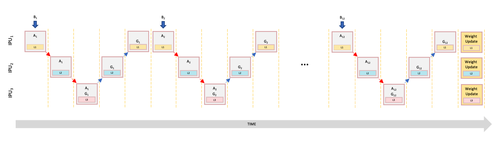

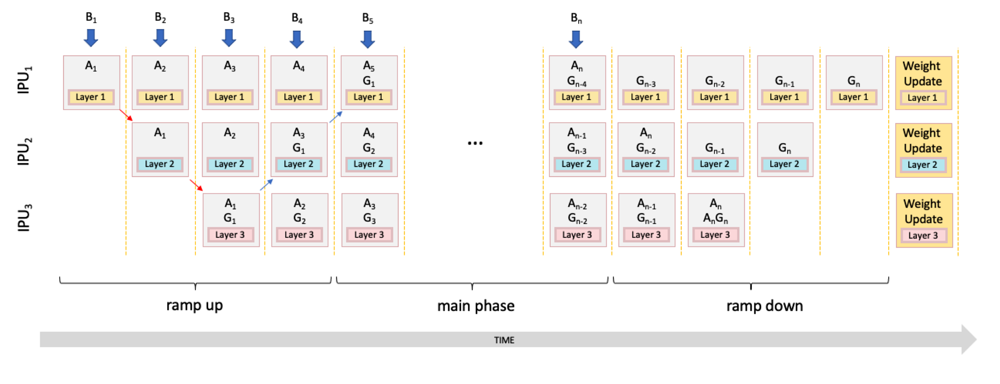

### 6.9 Activation Stash 与 Pipeline Recomputation

Pipeline training 中，某个 micro batch 的 backward pass 可能在多个 step 之后才回到同一个 IPU。该 IPU 必须保存 forward pass 的 activation，形成 activation stash。

普通 schedule 中，如果 pipeline 有 `N` 个 IPU，最大 stash 长度可达：

```text
2 * N - 1
```

activation stash 可能占用大量 memory。结合 recomputation 后，stash 可以只保存某个 stage 起始层的 activation，backward pass 时重新计算中间 activations，从而降低 stash memory。

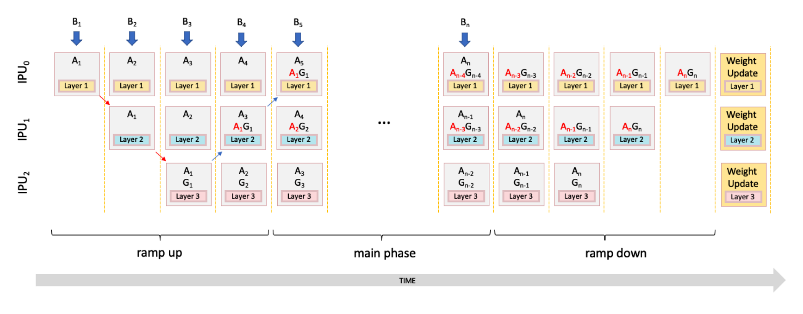

### 6.10 Interleaved Schedule Pipeline

Interleaved schedule 通过改变 forward/backward 在多个 IPU 上的调度顺序，减少 stash 长度。它可以把最大 stash 从约 `2 * N - 1` 降到 `N`。

代价是 forward 和 backward stage 更容易不平衡，因此整体速度可能低于普通高利用率 pipeline schedule。它适合 memory 更紧张、愿意牺牲部分吞吐的场景。

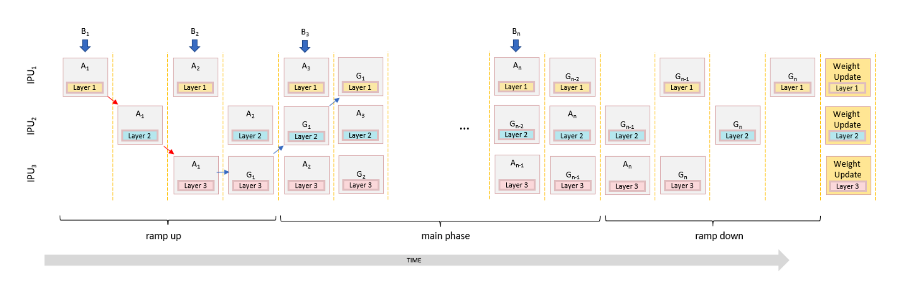

## 7. Batch Size 术语

IPU 文档中对 batch 相关术语的定义如下：

| 术语 | 含义 |
| --- | --- |
| Compute batch size | 单个 replica 中一次并行计算 activation/gradient 的样本数；如果使用 batch serialisation，它会小于 micro batch size |
| Micro batch size | 单个 replica 中一次完整 forward pass 处理的样本数；训练时也是一次完整 backward pass 对应的样本数 |
| Replica batch size | 单个 replica 对一次 weight update 贡献的样本数，等于 `micro batch size * gradient accumulation iterations` |
| Global batch size | 所有 replica 对一次 weight update 贡献的样本数，等于 `replica batch size * number of replicas` |

如果没有 gradient accumulation 或 replication，micro batch size 就等同于通常说的 mini-batch size。

## 8. 面向架构分析的抽象

从架构探索角度，可以把 IPU 抽象成如下对象：

```text
Hardware:
  IPU
    tiles[N]
      processor
      local SRAM
      memory banks
    exchange fabric
    Streaming Memory
    host/RDMA path

Program:
  variables
  tensor views
  tile mappings
  compute sets
  vertices
  codelets
  data streams
  control flow

Execution:
  compute phase
  sync phase
  exchange phase
  per-tile lowered program

Optimization:
  variable liveness
  data placement
  copy/rearrangement
  replication
  collectives
  gradient accumulation
  recomputation
  pipelining
```

对应的成本模型至少应覆盖：

- tile compute cycles；
- on-tile SRAM bandwidth 和 bank conflict；
- exchange fabric 带宽/同步开销；
- tile mapping 导致的数据移动量；
- Streaming Memory copy 成本；
- host/device data stream 成本；
- live memory peak；
- pipeline stage balance；
- activation stash 大小；
- replication collective 开销。

## 9. 与 GPU/TPU 路线的关键差异

| 维度 | IPU | GPU | TPU/矩阵阵列 |
| --- | --- | --- | --- |
| 计算组织 | 大量独立 tile，MIMD 风格更强 | SM/SIMT | systolic / matrix-centric |
| 主工作存储 | 分布式片上 SRAM | HBM + cache/shared memory | HBM + unified buffer / SRAM |
| 跨核通信 | 显式 exchange，BSP 同步 | 隐式 memory hierarchy + NoC | 数据流/矩阵数据搬运 |
| 编译器责任 | 很高，需要 placement、exchange、liveness | 中高 | 高 |
| 适合场景 | 图、不规则访问、中等 tensor、pipeline/model parallel | 大规模 dense tensor | dense matmul/conv |
| 主要约束 | 分布式 memory 容量和显式通信调度 | HBM 带宽/容量、SIMT divergence | 数据流适配、矩阵形状 |

IPU 的设计重点是让大量片上 SRAM 和显式通信成为可编译资源。这使它很适合讨论“硬件拓扑、存储层级、编译调度和算法组织”之间的共同设计。

## 10. 阅读建议

如果只读 Programmer's Guide，建议按以下顺序建立心智模型：

1. **IPU hardware overview**：先理解 tile、exchange fabric、In-Processor-Memory、Streaming Memory。
2. **Execution**：重点掌握 BSP 的 compute/sync/exchange。
3. **Tile architecture**：理解多线程 tile processor、AMP unit、本地 memory bank。
4. **Programming model**：理解 variable、tensor view、tile mapping、compute set、vertex、codelet。
5. **Compilation and execution**：理解全局 program 如何 lowering 到 per-tile program。
6. **Algorithmic techniques**：重点看 replication、gradient accumulation、recomputation 和 pipeline。

这份文档偏编程模型和执行语义。若要进一步做硬件架构分析，建议结合 Hot Chips 2021 Graphcore Colossus Mk2 IPU 资料和第三方 microbenchmark 论文一起看。
