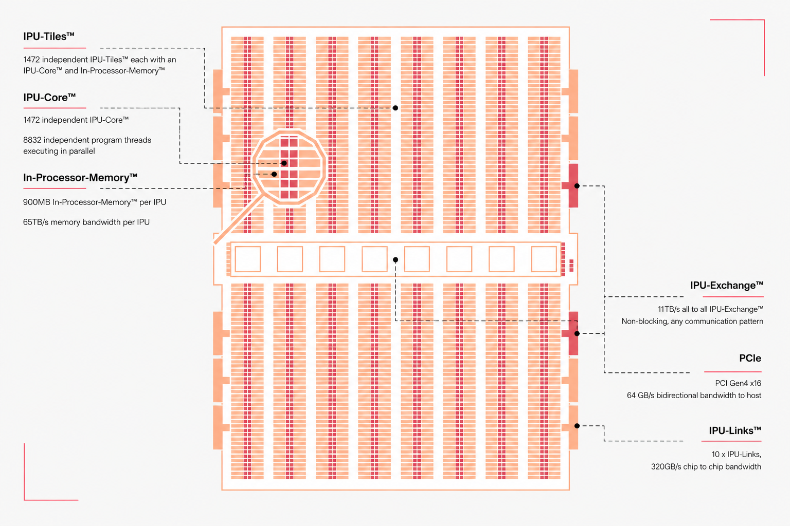
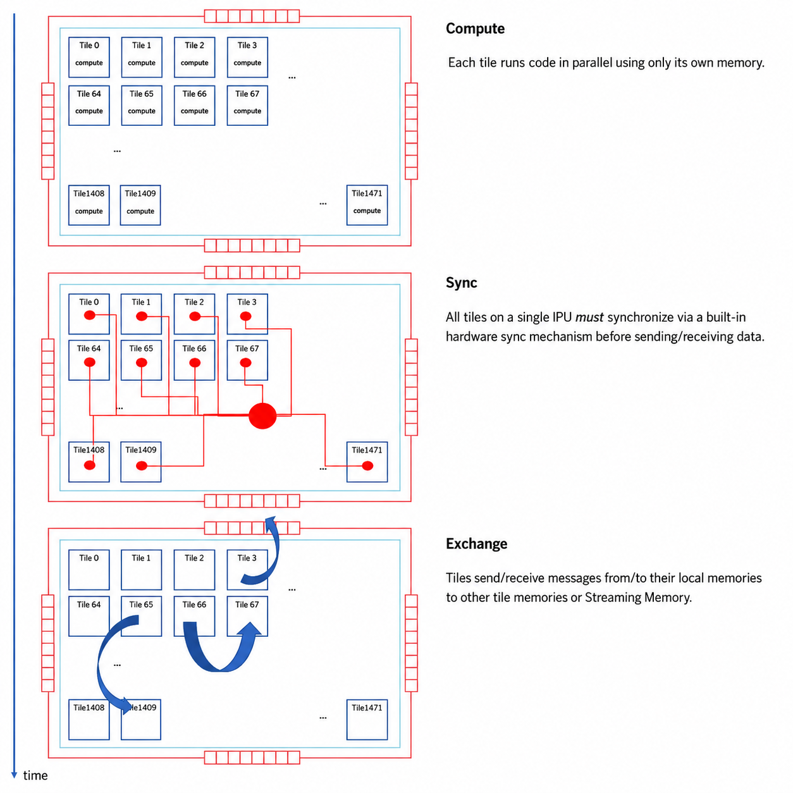
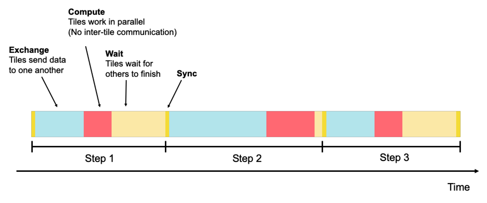
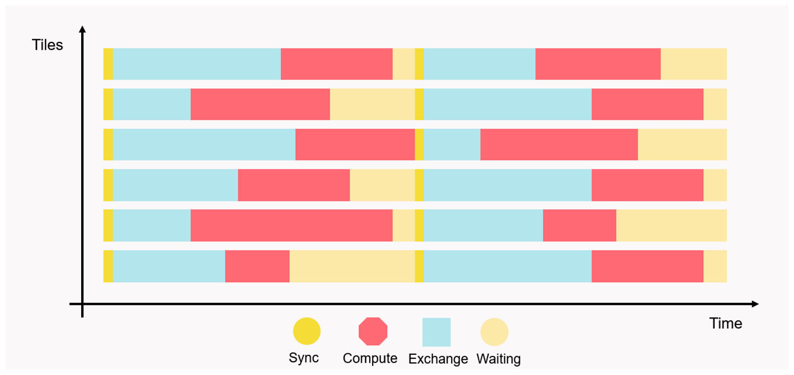
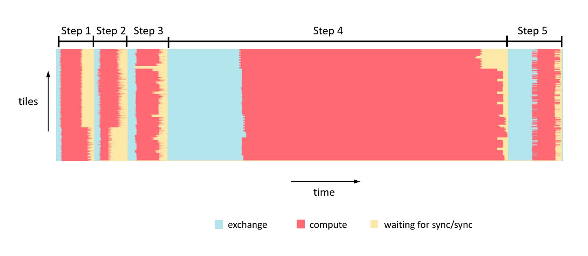

## 芯片架构图

## 执行模型
IPU 使用 Bulk Synchronous Parallel 模型。一个任务会被拆成多个 step，每个 step 包含：

```text
local tile compute
global cross-tile synchronisation
data exchange
```

在 compute 阶段，所有 tile 并行执行，只访问各自本地数据。tile 完成本地计算后进入同步。所有 tile 同步完成后，进入 exchange 阶段，tile 之间或 tile 与 Streaming Memory 之间执行数据搬运。之后继续下一轮 compute。

可以把 IPU 的主执行节奏理解为：

```text
repeat:
  compute on local tile memory
  sync all participating tiles
  exchange data through fabric
```

这个模型的架构意义很明确：计算和通信被分成阶段，通信是可编译、可调度、可分析的显式行为，而不是被隐藏在 cache miss 或动态内存系统之后。









## tile特性
tile = 多线程处理器 + 本地 SRAM + code memory + exchange 接口；整芯片是 MIMD，不是 SIMD。
- 32-bit 指令，single/dual issue，barrel threaded；MAIN path（控制流/整数/load-store）与 AUX path（浮点/向量/矩阵/超越/RNG）可 co-issue
- N+1 线程：7 context、6 round-robin slot；supervisor 用 RUN 派发 worker，worker 跑一个 codelet（约 1/6 主频）。隐藏 pipeline → 执行时间可预测 → 便于 load balance
- AMP：每 tile 每周期 64 MAC，f16×f16、f32 累加；聚合峰值 250 TFLOP/s
- 训练支持：每 tile 每 cycle 128 random bits、全速 stochastic rounding；支持 sparse gather load/store
## fabric
一种 compiler-scheduled 的 NoC：无 router、无 queue/arbiter/packet overhead，寻址靠“时间 + select state”而非 header。
- Exchange spine 1600×36b；每 tile 一条 36b send channel + 一个 1600-way receive mux，32b/cycle 收发
- 编译器从 sync 起按 cycle 精确编排 transmit/receive/select；片上同步约 150 cycles，跨芯片约 15 ns/hop

> 推测（非官方）：官方只说“每 tile 一个 1600-way receive mux”，但若真按单级 1600 路 mux 实现，1472 个 tile 各拉一个跨全芯片的 1600 输入巨型 mux，面积、布线和长线 RC 延迟都会爆炸，也无法解释它强调的确定性 pipeline delay。所以物理上更可能是分层、分段、流水化的静态交换网络：
> - tile 先组织成 local group，group 内用小型 crossbar/mux 做组内交换
> - group 经 column spine（按列的分段总线）接入更高层 global exchange
> - 再由 global exchange 通过目标 column/group 逐层下发到目标 tile
>
> 这样既能对外呈现逻辑上的 all-to-all，又避免单级 1600 路 mux 和全局长线；每多穿一层就多固定几拍，正好对应编译器需要的“已知 pipeline delay + cycle-accurate schedule”。代价是任意 tile→tile 不是等距，编译器排 exchange schedule 时要把不同跳数的延迟差算进去。
## 芯片迭代过程
- Mk2 的计算翻倍：125 → 250 TFLOP/s
- SRAM 容量大幅增加：304 MiB → 896 MiB
- tile 数增加不算特别大：1216 → 1472
- inter-tile / inter-chip 带宽基本没变
- 更大 tile memory
- 更高计算密度
- 更适合放下大 workspace / activation / model fragment
mk1的经验
- 功能放得太多，软件没完全用起来
- 256 KiB tile memory 太紧
- 大模型多芯片映射需要专家知识
- Whole-graph compilation 会越来越慢
- BSP 对电源裕量优化不友好，BSP 会导致大量 tile 在相近时间进入 compute 或 exchange，全芯片活动模式更同步，电流瞬态更集中，电源网络压力更大，
## 融资和经营情况
Graphcore 峰值估值是 28亿美元（不是30亿），2016年从 Xmos 拆分出来；累计融资 约7亿美元，投资人包括微软、红杉等；2022年营收 仅270万美元、税前亏损2.05亿美元；2023年营收 只有400万美元，远低于2019年Toon宣称的2024年要做到10亿美元；最终 2024年7月被软银以约5亿美元收购，低于其历史总融资额。
## 从中该获取的经验教训

### Graphcore 当年的下注（2016–2019 语境下并不荒谬）
- AI 算法形态不稳定，未来模型会更大、更稀疏、更图结构化
- 后 Dennard：memory 要靠近 logic；后 Moore：靠多芯片并行扩展
- 推论：别假设未来一定是大矩阵 dense GEMM，别把资源全押在大 systolic array / Tensor Core 上，而是提供大量细粒度、可编程、近存储的 tile

这套逻辑自洽，但它是一个**赌注**，不是定论——下面的失败正是赌注被证伪的过程。

### 失败原因
1. **软件生态（最致命）**。硬件不差，但 Poplar 要求开发者用一套与 CUDA 完全不同的模型思考（MIMD、片上大 SRAM、BSP、显式 tile/exchange 编排），对只想跑 PyTorch 的客户是迁移成本。Nvidia 二十年 CUDA 护城河，绕不过去。
2. **赌错 workload——而且对的那一半反而害了自己**。"模型更大"猜对了，"更稀疏/更图结构化"猜错了；恰恰"更大"最致命：大 dense 模型要的是 HBM 的容量+带宽，正好戳中 IPU 的弱项。市场走向 dense GEMM + 超大模型 + 渴求 HBM，"片上 SRAM 为王"的赌注落空，单颗 IPU 装不下大模型，被迫大量 inter-IPU 通信，而 off-chip 子系统又是它的弱项。
3. **时机与节奏**。Nvidia 持续快速迭代，Graphcore 下一代"Good computer"远未就绪。在每 12–18 个月重定基准的市场里，节奏掉队等于出局。
4. **商业执行与地缘**。微软 2019 年的供货合同据报最终告吹，2023 年底一度距破产仅数月；2023 年因出口管制关闭中国业务、收缩美国。失去 anchor customer + 失去中国市场，对缺乏量产出货的公司是双杀。
5. **制造与良率**。据 Jon Peddie 称良率偏低，直接推高成本、削弱对 Nvidia 的性价比。

### 可带走的原则
- **架构优雅 ≠ 可迁移性**。客户买的是迁移成本，不是峰值参数；Graphcore 在比硬件参数，Nvidia 在卖 CUDA 锁定。
- **单一架构对赌 = 高方差，且没有 fallback**。IPU 既不擅长 dense、又没有 HBM 后备，赌错即清零。押注 workload 背离主流时，要留退路。
- **时间是专用架构的敌人**。通用平台会持续吞掉专用优势，专用架构必须在窗口期内兑现，否则被通用性追平。
- **把复杂性转移给编译器/软件 = 把风险转移到软件团队规模**——而这正是初创最稀缺的资源。

### 我的判断
最大的问题不是管理，也不是"芯片技术错了"，而是没意识到在 AI 加速器赛道，护城河是软件栈和生态，不是硅片本身。一个再优雅的 MIMD/大 SRAM 架构，如果 mapping 和编译对客户不够透明，就无法转化为出货量。