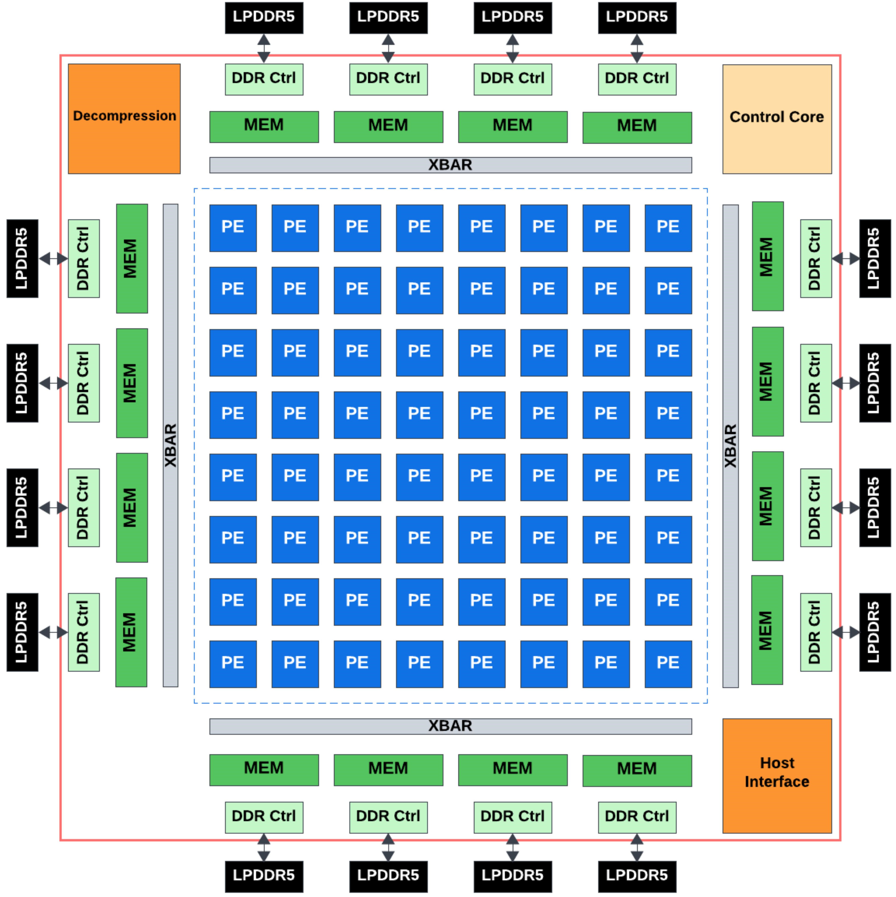
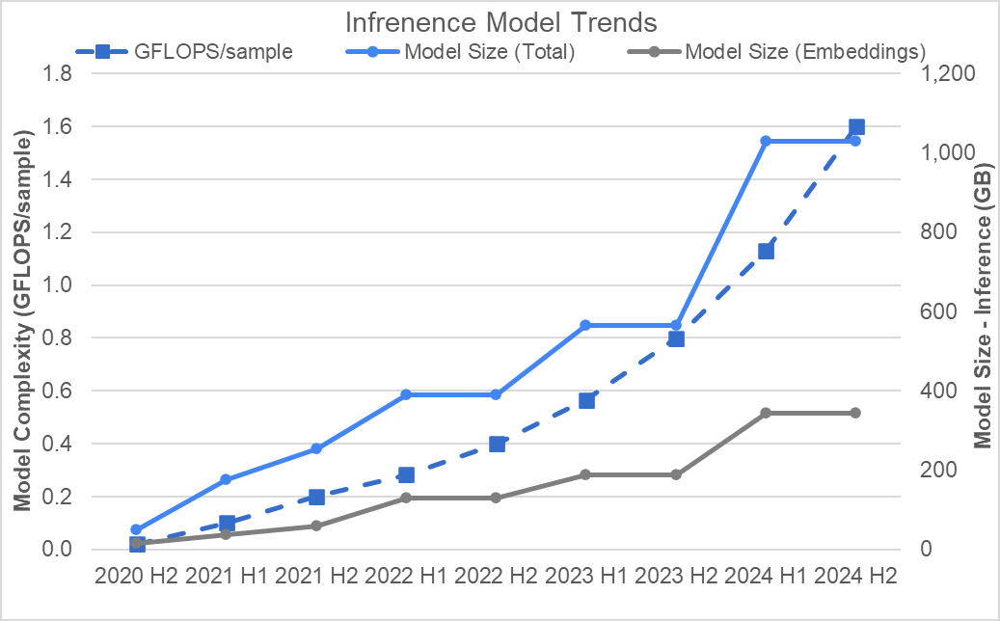
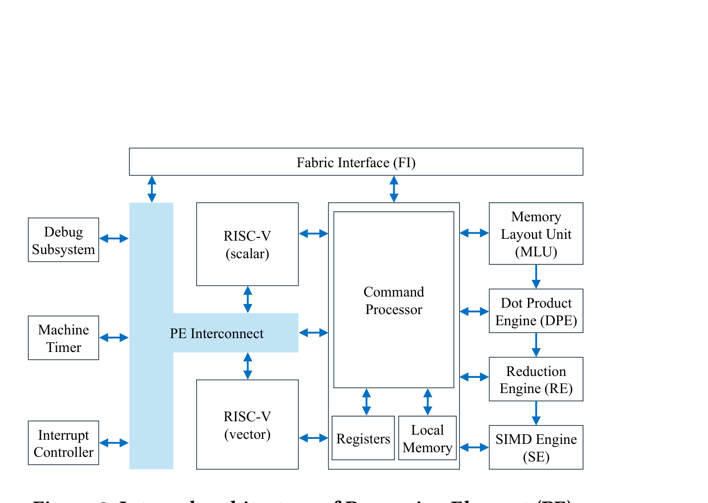
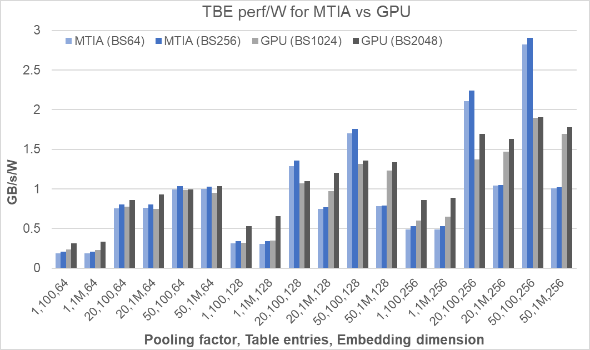

# Meta MTIA (v1 / v2)

一句话定位：**面向 Meta 内部推荐系统(ranking & recommendation, R&R)推理的 RISC-V 控制型 many-PE 加速器**。它不是 LLM 芯片、不追 dense GEMM 峰值,而是用 **8×8 PE 阵列 + 每 PE 内 RISC-V 控制 + fixed-function 异步 dataflow 流水 + 大 SRAM + LPDDR(不用 HBM)**,把 Meta 海量 DLRM/推荐推理跑出**更低 TCO / 更好 perf/W**。和 AWS 类似、与三家初创相反:**护城河是垂直整合 + 自有海量 workload(captive demand)+ PyTorch 全栈,而非把新颖架构卖给别人**。

命名对照:**MTIA v1 = MTIA 1 = MTIA 100**(ISCA'23);**MTIA v2 = MTIA 2i = MTIA 200**(ISCA'25);后续 MTIA 300/400/450/500 是更快节奏的路线(300 转向 chiplet,400/450/500 转向 GenAI)。



## 关键参数(官方 ISCA'25 Table 2)
| 维度 | MTIA 1 (v1) | MTIA 2i (v2) |
|---|---|---|
| 工艺 / 频率 | TSMC 7nm / 800 MHz | TSMC 5nm / 1.35 GHz |
| die 面积 | 19.3×19.1mm(~369mm²) | 25.6×16.4mm(~420mm²,1.13×) |
| TDP | 35W(典型 25W) | 85W(典型 65W) |
| Host | 8× PCIe Gen4(16 GB/s) | 8× PCIe Gen5(32 GB/s) |
| PE 阵列 | 8×8 = 64 | 8×8 = 64 |
| GEMM | 102.4 TOPS INT8 / 51.2 TFLOPS FP16 | 354 TOPS INT8 / 177 TFLOPS FP16·BF16 |
| GEMM(2:4 稀疏) | N/A | 708 TOPS INT8 / 354 TFLOPS FP16 |
| 每 PE Local Memory | 128 KB | 384 KB |
| 片上共享 SRAM | 128 MB | 256 MB |
| off-chip LPDDR5 | 32–64 GB | 64–128 GB |
| SRAM 带宽 | 0.8 TB/s | 2.7 TB/s |
| LPDDR5 带宽 | 176 GB/s | 204.8 GB/s |

v2 相对 v1:dense compute 约 **3.5×**、sparse compute 约 **7×**、PE local storage **3×**、SRAM 翻倍且带宽 3.5×、LPDDR 容量翻倍、NoC 带宽翻倍——而 die 面积只增 1.13×。

## 为什么做 MTIA:R&R 推理的规模与经济性
Meta 的主要推理 workload 是推荐/排序(DLRM 类),不是 LLM。这类模型的特点:**embedding + dense MLP + feature interaction 混合、batch 受限、有较强 locality(working set 可放 SRAM)**。模型复杂度与体积逐年快速增长(下图),用 GPU 跑这类 workload perf/W 与 TCO 并不划算——这正是 MTIA 的切入点:用便宜的 **大 SRAM + LPDDR** 替代昂贵的 HBM,把这部分推理从 GPU 上接过来。对不适合 MTIA 的模型,Meta 仍用 GPU。



## 执行模型:RISC-V 生成 custom instruction,CP 调度,fixed-function 异步 dataflow
不是 GPU 的 warp/SIMT,也不是纯 systolic。PE 上是 **asynchronous dataflow model**:
```text
RISC-V scalar/vector core 跑 kernel 控制代码
  ↓ 生成一系列 custom instructions
Command Processor(CP)
  ↓ 依赖检查 / 调度 / instruction tracking / Local Memory 仲裁 / circular buffer 抽象(下沉到硬件)
DPE / RE / SE / MLU / FI 异步执行(依赖满足即触发,DMA 与计算重叠)
```
一句话:**RISC-V 是可编程控制面,CP 是 PE 内 micro-scheduler,fixed-function units 是数据面**。CP 把 circular-buffer 管理和依赖跟踪做进硬件,是 MTIA 与 NeuronCore(多 engine 各自 sequencer)最大的控制流差异。

## PE 微架构:Local Memory + fixed-function 粗粒度流水
每个 PE = 两个 RISC-V core(scalar + 64B 宽 vector)+ 384KB Local Memory + 一组 fixed-function units,经 PE Interconnect 相连;fixed-function units 可直接访问 Local Memory 并**串成 coarse-grained pipeline**(数据从一个 unit 流到下一个)。



| 单元 | 职责 |
|---|---|
| **CP**(Command Processor) | 接收 custom instruction,做依赖检查/调度/tracking + Local Memory 仲裁 + circular buffer |
| **DPE**(Dot Product Engine) | GEMM/FC:一个 tensor 缓存进 DPE,另一个从 Local Memory streaming 进来做点积;v2 含两个 32×32B×32 MAC tile,~2.76 TFLOPS/PE(FP16→FP32),支持 2:4 稀疏 2× |
| **RE**(Reduction Engine) | 存储/累加 matmul 结果,可跨邻近 PE reduce,或转交 SE |
| **SE**(SIMD Engine) | vector op / quantization / nonlinear(带 LUT 近似),从 RE 或 Local Memory 取数 |
| **MLU**(Memory Layout Unit) | transpose / concat / reshape 等 layout 变换——生产模型里实打实吃 latency/带宽的部分 |
| **FI**(Fabric Interface) | PE Local Memory ↔ NoC/共享SRAM/LPDDR 的搬运端口(DMA) |

典型 FC+activation 数据流:`FI/DMA: SRAM/LPDDR→Local Memory → DPE(GEMM)→ RE(累加/跨PE reduce)→ SE(quant/activation)→ FI/DMA: →SRAM/LPDDR`。

## Memory hierarchy:大 SRAM 当核心,LPDDR 补容量,刻意不用 HBM
```text
PE Local Memory  384KB/PE   固定功能流水的近端暂存
共享 on-chip SRAM 256MB     全 PE 共享,2.7 TB/s,可按 32MB 粒度切成 LLC + LLS
LPDDR5          64–128GB    204.8 GB/s,放模型参数/embedding/不常驻数据
```
SRAM(2.7 TB/s)与 LPDDR(204.8 GB/s)差约 **13×**——所以**让数据尽量命中片上 SRAM 是性能关键**。256MB SRAM 的混合设计很有特色,既不是纯硬件 cache 也不是纯软件 scratchpad:
- **LLS**(software-managed scratch):pin 住整个 activation buffer,避免被换出/污染
- **LLC**(hardware-managed cache):缓存 weights / 稀疏访问

Meta 的 autotuning 自动决定 LLS/LLC 划分:典型策略是让 LLS 装下整个 activation buffer、其余作 LLC;装不下时再比较"小 batch 的 LLS 方案"与"当前 batch 的 LLC 方案"。

## NoC
custom NoC 连接 64 PE、host、Control Core 与 memory subsystem,经 die **四边的 crossbar** 接共享 SRAM 和 off-chip 控制器。是 **non-blocking** 架构以减少不同 initiator 间干扰;源端 flow control + **leaky-bucket traffic shaping + packet fragmentation** 平滑流量、防突发拥塞。它不只服务 PE↔PE,也服务 PE↔SRAM、PE↔LPDDR、PE↔host。

## 模型-芯片协同:论文真正的价值
MTIA 论文最有料的不是 PE 结构,而是**生产化经验**——最终线上 P99/吞吐/TCO 由模型结构 + SRAM placement + 调度 + fusion + DMA + NoC contention 共同决定,而非单看 TOPS。Meta 做了:data placement / batch size autotuning、kernel tuning、request coalescing、model sharding、graph fusion、SRAM hit-rate 优化、必要时 reject/transform 模型。
- dense 网络经 buffer placement + fusion + 额外 LLC tiling 可达 **>95% SRAM hit rate**;sparse 网络也能让 40–60% 访问命中 SRAM
- 复杂 GEMM:把 activation 预载入各 PE 的分布式 Local Memory、跨 PE 列 **broadcast weights**(硬件 broadcast read 消除 NoC 争用)、weight tile 预取进 LLC 隐藏 DRAM 延迟——某些 shape latency 改善 45%,并达 >95% DRAM 带宽利用



## 为什么不适合 LLM decode
MTIA 2i 的设计点建立在**推荐模型的 locality**上(模型相对小,working set 可放 SRAM,最大化 SRAM reuse)。论文坦承:**一旦模型大小/复杂度超出 SRAM 容量,有限的 off-chip 带宽会让性能急剧下降**——GEMM 变成 DRAM-bandwidth-bound。对 Llama2-7B,prefill 能满足 600ms TTFT,但 **decode 满足不了每 token 60ms** 的要求(每 token 重复读大量权重/KV,LPDDR 带宽不够)。这印证:decode 看的是有效带宽 × reuse,不是峰值 FLOPS。

## 芯片迭代与路线
- **MTIA 1 / 100**(ISCA'23,2023):第一代 R&R 推理 ASIC,验证 8×8 PE + SRAM + LPDDR + PyTorch 全栈协同
- **MTIA 2i / 200**(ISCA'25,2024):同样 8×8,但三倍性能(die 仅 +13%),PE 内大幅增强(DPE/RE/SE/MLU/CP),已大规模量产部署
- **MTIA 300/400/450/500**:节奏明显加快(Meta 称两年内多颗)。**300 从单片 die 转向 chiplet**(计算 chiplet + SRAM + 内存控制器分离);400/450/500 逐步转向 **GenAI / GenAI inference**

迭代逻辑:**在同一 RISC-V 控制 + fixed-function dataflow + 大 SRAM 范式上演进**,并随 Meta workload 从 R&R 向 GenAI 迁移而调整;早期坚决不用 HBM、后续转 chiplet 以扩展。

## 战略定位与商业背景
- **captive demand 是最大底气**:推荐/排序是 Meta 体量最大的推理 workload,MTIA 不需要对外卖、不需要架构惊艳,只要在 Meta 自有 fleet 上比 GPU 更省 TCO/W 就成立
- **与 GPU 互补而非替代**:Meta 同时是超大 GPU 买家(GenAI/训练);MTIA 专吃适合它的 R&R 推理,不适合的继续上 GPU
- **PyTorch 全栈 co-design**:芯片 + 编译/kernel + 推荐模型一起设计,eager mode 支持降低内部迁移成本——这是 Meta 相比初创的关键优势(现成的框架 + 模型 + 部署闭环)

## 从中该获取的经验教训

### MTIA 的下注
- **不赌通用,赌一类自有 workload**:窄到"Meta 推荐推理"这一个场景,用大 SRAM+LPDDR 的低成本组合精确匹配其 locality,而不是追求覆盖所有 AI
- **控制流硬件化**:把依赖跟踪 + circular buffer 管理下沉进 Command Processor,让 RISC-V 只管发 custom instruction,fixed-function 异步跑——比"软件管一切"更省 PE 内开销
- **MLU 把 layout 变换当一等公民**:承认生产模型里 transpose/reshape 真实消耗带宽与延迟,专门给硬件单元——很多学术加速器忽略这点

### 该警惕的点
- **强绑 SRAM locality = 强绑 workload**:模型一旦超出 SRAM,LPDDR 带宽立刻成瓶颈(13× 落差),所以 MTIA 对 LLM decode/长上下文/大模型天然不友好——这是设计选择,不是 bug
- **autotuning/协同优化是隐性成本**:>95% SRAM hit rate 不是白来的,是 placement/fusion/coalescing/sharding 大量工程换来的;这套闭环只有"芯片+模型+框架"都在自己手里才转得动

### 与四家的对照
- 和 **AWS** 是同一类"非初创"打法:**captive/anchor 需求 + 垂直整合 + 够用的保守架构**,护城河不在硅片新颖度。区别是 AWS 卖云算力给外部 + Anthropic,Meta 纯自用
- 和 **Graphcore/Cerebras/SambaNova** 相反:三家把架构新颖度当卖点去赢外部客户,普遍撞上软件生态 + workload 演化 + 商业兑现的墙;MTIA/AWS 用"自有海量需求"绕开了初创最缺的出货量与真实负载

---
*本文基于 raw/ 下官方论文(MTIA ISCA'23、ISCA'25)与对应 chat 梳理;命名/路线图来自公开报道(截至 2026-06)。规格数字以 ISCA'25 Table 2 为准。架构图取自论文:`chip_architecture`(Fig 1)、`pe_internal`(Fig 2)、`perfw_vs_gpu`、`model_trends`。*
