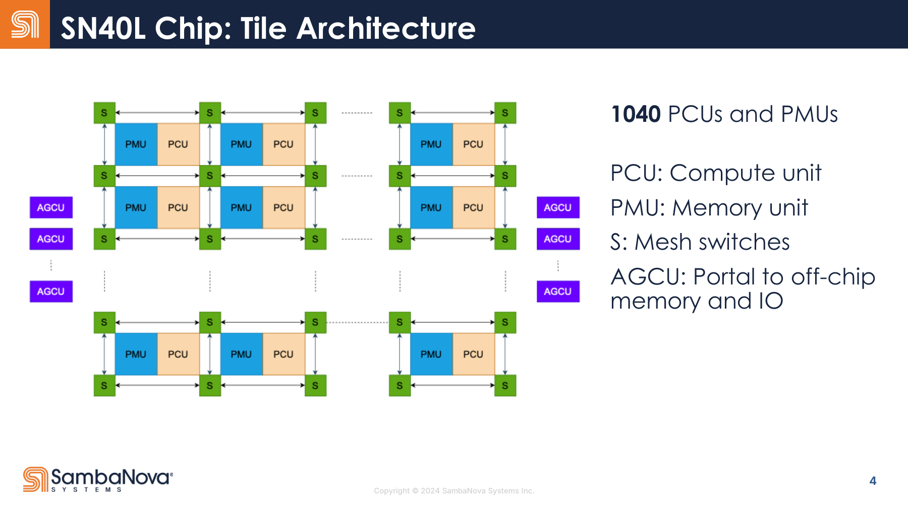
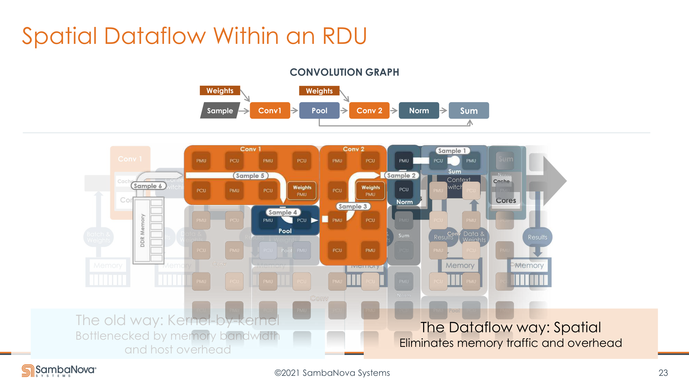
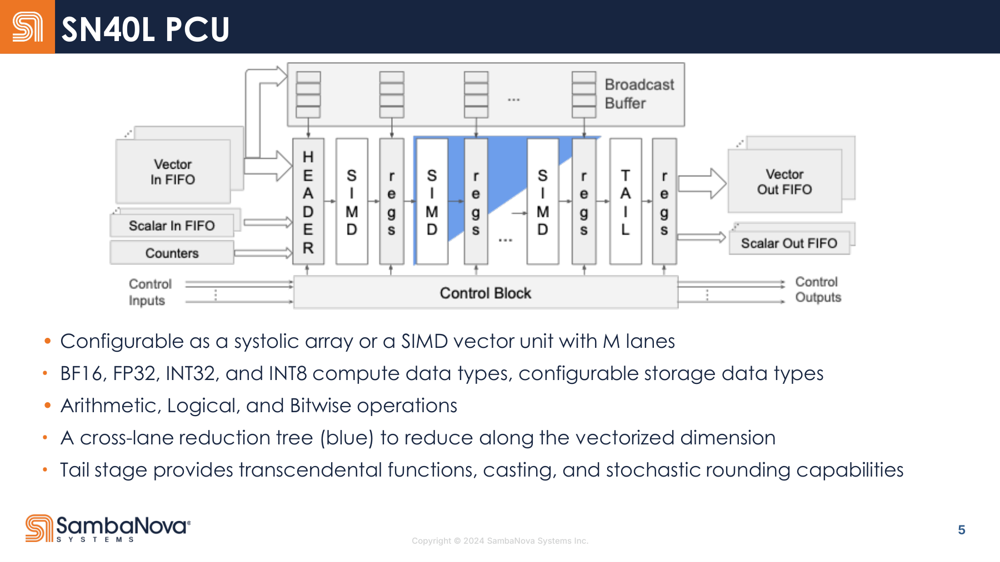
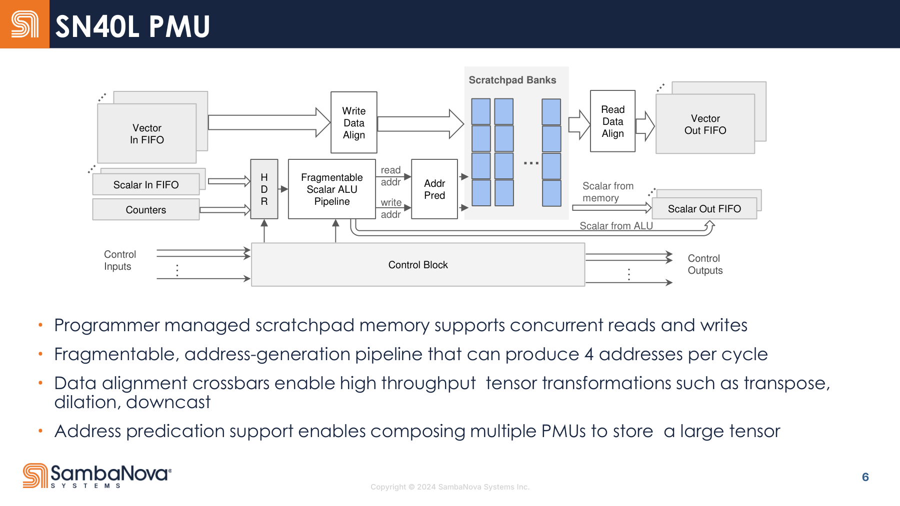
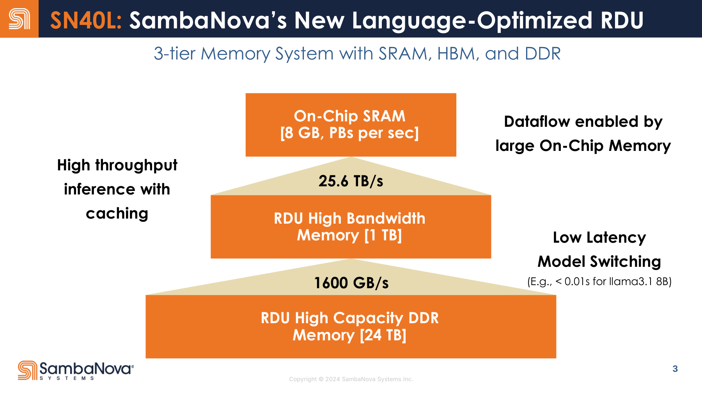
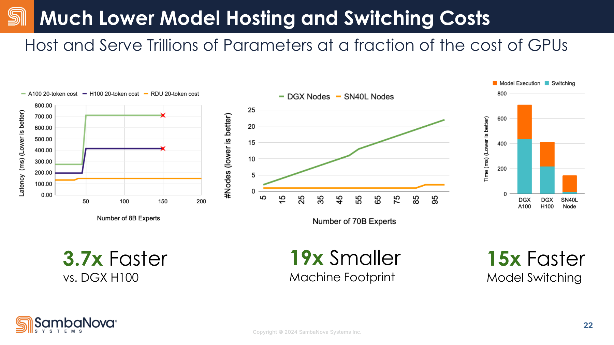

# SambaNova RDU / RDA

一句话定位：**CGRA 风格的空间数据流（spatial dataflow）AI 加速器**——不像 GPU 把模型拆成 kernel 逐个时分执行，也不像 TPU 围绕一块大 systolic array，而是把模型图的一段子图**空间映射**成"计算单元 PCU + 存储单元 PMU + 可编程片上通信 RDN"的可重构流水线。核心卖点不是单个矩阵阵列多强，而是**把 compute / memory / interconnect 都变成编译器可显式编排的资源**，从而做激进的算子融合、pipeline parallelism 和多模型 memory hierarchy 管理。



## 关键参数（SN40L，单 RDU/socket 口径）
| 项 | 值 |
|---|---|
| 工艺 / 晶体管 | TSMC 5nm / 102B（多 die 封装） |
| PCU / PMU | 1040 / 1040 |
| 算力 | 638 BF16 TFLOPS（BF16 乘 + FP32 累加；另支持 FP32/INT32/INT8） |
| 片上 SRAM | 520 MB（分布在 PMU 中，非 cache） |
| HBM | 64 GB |
| 高容量 DDR | 1.5 TB |
| 三层 memory | On-chip SRAM + HBM + DDR |

> **口径警告**：SambaNova 很爱在 socket / node / rack 不同层级讲 memory。HC2024 三层 memory 图给的 **8GB SRAM / 1TB HBM / 24TB DDR / 25.6 TB/s / 1600 GB/s** 是**系统/节点级聚合口径**，不是单 RDU。看任何容量数字先确认是单芯片还是整机。

## 执行模型：spatial dataflow，不是 kernel-by-kernel
GPU 把一个 kernel 在大量 SM 上**时分复用**；RDA 把一段 graph **空间展开**成硬件流水线。基本执行单元不是 thread，而是 **dataflow stage**：

```text
graph segment → 空间流水线
  PMU(stage buffer) → PCU(compute) → PMU(layout transform) → PCU(compute) → ...
```

编译器把每个 operator/buffer/transform 映射到不同 PCU/PMU 上，数据像流一样穿过这些资源；中间结果**不反复落 HBM**，算子之间**没有 kernel 边界**。这就是 SambaNova 说的 **spatial programming**——配置 RDU 物理资源，让数据在 fabric 上并行流动。



它真正想解决的是 **operator fusion + memory wall**：小模型/expert 常 operational intensity 低、图里有 transpose/shuffle/many-to-one 等复杂访问，GPU 受 kernel 模型 + SM 间通信 + cache/HBM materialize 限制很难完全 fuse。论文用 Monarch FFT 风格图说明：不 fusion 时 operational intensity 仅 39.5 ops/byte，部分 fusion 102.6，完全 spatial fusion 可达 410.4。

## PCU（Pattern Compute Unit）：可配置计算流水线
不是固定 MAC 阵列，也不是 GPU SM。datapath 分 **Header → Body → Tail**，可在两种模式间配置：
- **systolic 模式**：body 配成 output-stationary systolic array 做 GEMM，A/B 以 stream 流入、partial sum 留阵列内、tail drain 到 output FIFO
- **SIMD 模式**：body 配成 M-lane 向量流水线做 elementwise/activation/norm，带 **cross-lane reduction tree**
- **Tail stage**：超越函数（exp/sigmoid）、casting、随机数、stochastic rounding，可与 body compute fuse
- **Header + counters + control**：counters 跟踪 loop iteration、到上限发 control token——PCU 不是被指令流逐拍驱动，而是一个**有限状态的数据流计算 stage**



## PMU（Pattern Memory Unit）：可编程 memory 流水线，不是普通 SRAM
SambaNova 最有特色的部件。**PMU = banked SRAM + 地址生成器 + data alignment crossbar + predicate/banking + stream 接口**，承担三重角色：
- **stage buffer**：graph pipeline 的中间结果缓冲，支持 concurrent read/write
- **address-generation engine**：fragmentable scalar ALU pipeline，每周期产 4 个地址；支持 bitfield extraction/shift 等复杂寻址；read/write 地址流水线可被软件**切分**，按读写模式分配 stage 数
- **layout transformation unit**：data alignment crossbar 做 transpose/permute/dilation/downcast。关键技巧——**transpose 可以不是计算算子，而是 PMU 的读写布局行为**：写入时按对角条带格式存 bank，读出时直接读成转置 stream（GPU 上 transpose 往往是 fusion 难点，要跨 SM/落 cache）



一句话：**PCU 让数据"算起来"，PMU 让数据"以正确的顺序、布局、带宽流起来"。**

## RDN（Reconfigurable Dataflow Network）：三张并行物理网络
不是"一张 NoC + 三种 packet"，而是**三张并行的 2D mesh 网络**，由 non-blocking switch 组成，把 PCU/PMU/AGCU 串成 dataflow fabric：
- **Vector network**（packet-switched）：搬 tensor data，主数据平面；packet 带 sequence ID，**many-to-one 时由 PMU 用 sequence ID 算 write address 重排**，把保序语义下沉到 PMU
- **Scalar network**（packet-switched）：搬地址/metadata/loop index，也可搬小数据；PMU 的 scalar ALU 可从 scalar 网吃 operand、把算好的地址输出，**复杂地址计算可跨多个 PMU 组合**
- **Control network**（**circuit-switched**，bit 级）：搬 flow control / 同步 / graph orchestration token，通常对应 counter "done" event；用单 bit wire 而非 packet，因为 token 要极低开销、低延迟、固定路径

路由：硬件 2D dimension-order routing（DOR）+ 软件 static flow routing（编译器给 stream 分 flow ID，逐 switch decode 并重写，从而支持 multicast）。**三网分离**是因为 dataflow 天然有"大块数据 / 地址 metadata / 同步 token"三类 traffic，混在一张网会让大包阻塞 control token。真正把 PCU/PMU 串起来的是**编译器的 place-and-route**。

> RDN switch 的 local 端口连的是本地 dataflow unit 的 network port，这个 unit 可以是 PCU、PMU 或 AGCU；PCU/PMU 物理上常成对相邻，但逻辑上不是私有绑定。

## AGCU（Address Generation & Coalescing Unit）：dataflow 与外部世界的边界
不是普通 DMA。tile 侧暴露 RDN vector/scalar/control 端口，TLN 侧生成 read/write request 并 coalesce。职责 = **DMA/LD-ST + 地址生成 + coalescer + 地址翻译（Segment Lookaside Buffer）+ graph launch/orchestration + P2P endpoint**。支持无 host 参与的 graph schedule 编排；支持 RDU 间 P2P（数据直接 stream 到别的 socket 的 RDU tile，不经 DDR/HBM，用于 AllReduce 等 collective）。

## 三层 memory：SRAM + HBM + DDR，为 GenAI/CoE 而设
```text
SRAM (片上)  : dataflow pipeline 的 stage buffer / 中间结果
HBM         : 当前活跃模型 / router / 当前 expert，支撑高带宽 decode
DDR (大容量) : expert 仓库 / 大模型参数，低成本大容量 + 快速 model switching
```
策略是 **DDR = expert warehouse，HBM = active expert cache，SRAM = execution buffer**——不是"所有权重永远驻 HBM"。这对 Composition of Experts 很合理，但不一定等价适合单个超大 dense model 的低延迟 serving。



## CoE（Composition of Experts）：SambaNova 的系统级叙事
SN40L paper 的中心不是普通 LLM，而是 CoE——**多个独立训练/微调的小模型 + 一个 router model 组成系统**（区别于 MoE 的"模型内部专家层"）。论文 Samba-CoE 有 150 个 Llama2-7B expert、总参数 >1T，部署在一个 8-socket SN40L node：**所有 expert 权重放 DDR、router 放 HBM**；一次推理 = 跑 router → 从 DDR 拷贝选中 expert 到 HBM → 跑 expert。三层 memory 正是为这个假设优化（model switching 可 <0.01s）。

背后的赌注：**未来企业 AI 不一定是一个巨型 monolithic LLM，而可能是大量 specialized 小模型的组合。**



## 编译器与 runtime：复杂度的真正所在
- **SambaFlow**：把 PyTorch/TensorFlow 图抽取、优化、映射成空间布局 + 通信 pattern + pipeline schedule + PEF（可执行）。RDU 没有传统固定 ISA，而是**针对每个模型专门编程**，生成类似 application-specific accelerator 的映射
- **RDARuntime**：RDU 上的"AI accelerator OS"。向 OS 暴露**单个 virtual device**，进程申请抽象 compute resource，runtime 把 virtual RDU 映射到 physical RDU（对比 CUDA 每卡一个 device file、进程显式选卡）；借鉴 DPDK/OS-bypass——kernel driver 管初始化/设备/中断，运行时把硬件区域动态映射进应用虚拟内存，兼顾资源管理与低延迟配置

## 芯片迭代：SN10 → SN40L
| | Cardinal SN10 | SN40L |
|---|---|---|
| 年份 / 材料 | 2021 / HC2021 | 2023–24 / HC2024 + paper |
| 工艺 | TSMC 7nm | TSMC 5nm |
| 晶体管 | 40B | 102B（多 die） |
| PCU / PMU | 640 / 640 | 1040 / 1040 |
| BF16 算力 | >300 TFLOPS | 638 TFLOPS |
| 片上 SRAM | >300 MB | 520 MB |
| off-chip | DDR（SN10-8R：8 RDU + 12TB DDR4） | **HBM 64GB + DDR 1.5TB（三层）** |
| 叙事重点 | 通用 dataflow、训练、AI for Science | LLM/GenAI、CoE、streaming dataflow、推理 |

代际核心变化：**从"通用 RDA"转向"LLM/GenAI optimized RDA"**——最大的结构性升级是**加入 HBM、形成 SRAM+HBM+DDR 三层 memory**，专门服务 CoE 的 model switching。

## 融资和经营情况
- 2017 年 11 月成立于 Palo Alto，创始人 Rodrigo Liang（CEO）+ 斯坦福教授 Kunle Olukotun、Christopher Ré
- 2021 年 4 月 Series D **$676M**（SoftBank Vision Fund 2 领投），累计融资 >$10 亿、估值 **>$50 亿**，一度号称"全球融资最多的 AI 初创"
- 2025 年 4 月裁员 77 人（约占 500 人的 15%），明确**从训练转向 fine-tuning/inference**
- 2025 年 10 月有报道称其融资不顺、在接触买家探索出售
- 2026 年 2 月 Series E **$350M+**（Vista Equity + Cambium 领投），post-money 约 **$22 亿**——较 2021 峰值大幅缩水
- 营收长期偏弱（多处反映 2024 年营收近乎可忽略，需谨慎对待该口径）

## 从中该获取的经验教训

### SambaNova 的下注
- **spatial dataflow 比 kernel-by-kernel 更适合复杂图融合**：大量 elementwise/reduce/transpose/layout transform/small GEMM/pipeline 的 workload，空间流水线确实可能比 GPU 逐 kernel 更高效
- **PMU 是真正的架构创新点**：把 memory 从"被动 SRAM"升级成"可编程地址生成 + layout transform 引擎"，让 transpose/permute 等变成 memory 行为而非计算算子
- **三层 memory + CoE**：DDR 存大量 expert、HBM 缓存当前 expert、SRAM 做 pipeline buffer，比"一切塞进 HBM"更适合多模型系统

### 该警惕的点（批判）
- **compiler 是生死线**：硬件越灵活，映射空间越大。PCU/PMU/RDN/AGCU 的 allocation、routing、bandwidth model、pipeline balance 全靠 SambaFlow；软件还要同时管 tile/HBM/DDR/die-to-die/P2P/host 多种带宽，static bandwidth model 一错满盘皆输
- **动态 shape / 动态 control flow 不友好**：RDA 适合静态图段空间映射，越动态越需要重编排或 fallback，mapping/runtime overhead 上升
- **CoE 叙事依赖 workload 假设**：若未来主流是"大量 small expert + router"，三层 memory 很值钱；若主流仍是少数 dense frontier model + 长上下文 serving，CoE model switching 的优势就没那么直接——而 2024 后市场恰恰更偏后者，这也是它被迫从训练转推理的背景
- **生态壁垒**：GPU 的护城河是 CUDA/PyTorch/Triton/NCCL/profiling/部署生态。full-stack 垂直集成换性能，代价是客户迁移成本极高

### 与 Cerebras / Graphcore 的对照
- **三者都反 GPU 的 cache-HBM 路线、都把复杂性压给编译器**。差别在 scale 策略：Cerebras 用 wafer-scale 把规模做到极致；SambaNova 用 socket/node/rack + PMU/RDN/AGCU + 三层 memory 组合解决 memory wall
- 与 **Graphcore** 同病相怜：技术上漂亮，但都撞上"软件生态 + workload 演化方向 + 商业兑现"三重墙。SambaNova 估值从 $50 亿跌到 $22 亿、被迫转型，本质和 Graphcore 一样——**优雅的空间数据流架构，若 mapping/编译对客户不够透明、又没踩中需求曲线，就难转化为出货量**

---
*本文基于 raw/ 下官方资料（RDA 白皮书、HC2021 SN10、HC2024 SN40L、SN40L paper、RDARuntime paper）与对应 chat 梳理；经营数据来自公开报道（截至 2026-06）。架构图取自官方幻灯片：`tile_architecture`/`pcu`/`pmu`/`three_tier_memory`/`coe_cost` 来自 HC2024 SN40L，`spatial_vs_kernel` 来自 HC2021 SN10。三层 memory 图为系统级口径。*
