# 云端 AI 推理 / 训练芯片架构横向对比报告

> 范围：本仓库收录的 7 家非 NVIDIA 厂商的云端 AI 加速器
> AWS NeuronCore（Trainium2）· Cerebras WSE · Graphcore IPU · Groq LPU/TSP · Meta MTIA · Microsoft Maia 100 · SambaNova RDU
>
> 编写日期：2026-06-07
> 资料基础：仓库内各厂商的 Hot Chips 演讲、官方架构文档、第三方论文与分析（PDF/HTML/Markdown），辅以公开资料核对参数。完整资料清单与外部来源见文末附录。
>
> 侧重：**横向对比**。报告以「架构分歧轴」为主线，把 7 家产品放在同一组维度上对照，突出各自的设计取舍；逐厂商速写仅作锚点。
>
> 图示：本文的架构图 / 数据流图 / 编程模型图采用 **Mermaid** 绘制，可在 GitHub、VS Code（装 Mermaid 插件）、Typora、Obsidian 等支持 Mermaid 的查看器中直接渲染；少量时序表与网格用 ASCII 直绘。

---

## 0. 阅读地图

这批厂商表面上都在做「矩阵乘加速」，但骨子里代表了**至少四条互不相同的架构路线**，分歧点集中在三个根本问题上：

1. **算力如何组织**——一块大矩阵阵列，还是成百上千个独立小核 / 可重构单元？
2. **主工作存储放在哪**——片上 SRAM 当主存，还是 HBM 当主存，还是分层金字塔？
3. **执行时序谁来决定**——硬件运行时动态决定，还是编译器在编译期就钉死？

把这三个问题摊开，就得到本报告的主线。第 1 章给一张总规格表建立量感；第 2 章是核心，沿 7 条「架构分歧轴」逐条横向对比；第 3 章是逐厂商速写；第 4 章给出取舍总结与选型视角；第 5 章是给架构工程师的提炼结论。

一句话定位：

| 厂商 / 芯片 | 一句话定位 | 计算范式 | 主存哲学 |
| --- | --- | --- | --- |
| **AWS Trainium2 / NeuronCore-v3** | 云厂商自研、面向训练+推理的成本优化矩阵机 | 收缩阵列 + 多引擎异构 | HBM 主存 |
| **Cerebras WSE-3** | 整片晶圆当一颗芯片，SRAM 即主存的极端并行机 | 晶圆级众核数据流 | 片上 SRAM 主存（无 HBM） |
| **Graphcore IPU (GC200)** | 大量独立 tile + 显式 BSP 通信的 MIMD 众核 | tiled 众核 / BSP | 分布式片上 SRAM + DDR 流式 |
| **Groq LPU / TSP** | 把时序前移到编译期、追求「性能确定性」的推理流处理器 | 功能切片流式 | 片上 SRAM（无 DRAM） |
| **Meta MTIA v2** | 为推荐/排序模型定制、强调性价比的内部 ASIC | PE 网格矩阵 | LPDDR5 主存 |
| **Microsoft Maia 100** | 为 Azure 自家负载（含 GPT 类）定制的云推理加速器 | 张量单元 + 超标量向量 | HBM2E 主存 |
| **SambaNova SN40L** | 可重构空间数据流 + 三层内存，主打超大模型/专家组合 | 可重构数据流 (RDU) | SRAM+HBM+DDR 三层 |

**设计空间地图**——把第 2 章的分歧轴压缩成三条坐标，七家的位置一目了然：

```text
                编译期钉死时序（强确定性）
                          ▲
                 Groq ●   │   ● Graphcore
                          │
   固定矩阵阵列 ──────────┼──────────────► 可重构 / 空间数据流
   ● AWS  ● Maia  ● Meta  │     ● Cerebras      ● SambaNova
                          │
                 运行时动态时序（弱确定性）
                          ▼

   第三条隐轴 —— 主存位置：
     片上 SRAM 主存 : Cerebras · Groq     （去 HBM，靠集群把模型铺开）
     HBM 主存       : AWS · Maia          （单芯片自洽）
     LPDDR5 主存    : Meta                （够用就好、压成本）
     三层金字塔     : SambaNova           （SRAM + HBM + DDR）
```

---

## 1. 总规格对照表

> 数值多取自各厂商公开旗舰产品（Trainium2、WSE-3、Colossus Mk2 GC200、Groq TSP gen1、MTIA v2、Maia 100、SN40L）。不同来源口径不一，标注「约」者为近似；空白表示公开资料未明确给出。算力口径已尽量标注数制。

| 维度 | AWS Trainium2 | Cerebras WSE-3 | Graphcore GC200 | Groq TSP | Meta MTIA v2 | Microsoft Maia 100 | SambaNova SN40L |
| --- | --- | --- | --- | --- | --- | --- | --- |
| 工艺 | TSMC 5nm | TSMC 5nm | TSMC 7nm | 14nm（gen1） | TSMC 5nm | TSMC N5 | TSMC 5nm |
| 封装 | — | 整片晶圆 | 单 die | 单 die | — | CoWoS-S | 2.5D CoWoS 双 die 芯粒 |
| 晶体管 | — | 4 万亿 | 59.4 B | 26.8 B | — | 105 B | — |
| 裸片面积 | — | 46,225 mm²（整片） | 823 mm² | ~725 mm² | — | ~820 mm²（reticle 上限） | — |
| 计算单元组织 | 每芯 8× NeuronCore-v3，每核 128×128 收缩阵列 | 900,000 个 AI 核 | 1472 个 tile（每 tile 6 线程） | 功能切片：MXM/VXM/SXM/MEM | 8×8 = 64 个 PE | 张量单元 16×R×16 + 向量超标量 | 1040 PCU + 1040 PMU |
| 峰值算力 | 每核 158 FP8 / 79 BF16 TFLOPS（×8 核） | 125 PFLOPS FP16 | 250 TFLOPS FP16 / 62 TFLOPS FP32 | 750 TOPS INT8 / 188 TFLOPS FP16 | 较 v1 提升 3.5×（密集）/7×（稀疏） | 支持 MX/BF16/FP32（峰值未公开） | 638 BF16 TFLOPS/socket |
| 片上 SRAM | 28 MiB SBUF + 2 MiB PSUM（每核） | 44 GB | 896 MiB（624 KB/tile） | 220–230 MB | 256 MB（384 KB/PE） | ~500 MB L1/L2 | 520 MiB（PMU） |
| 片上带宽 | — | 21 PB/s | 47.5 TB/s | 80 TB/s | 2.7 TB/s | — | 数百 TB/s |
| 片外主存 | 96 GiB HBM | 无（外接 MemoryX，最高 ~1.2–1.5 PB） | DDR（Streaming Memory） | 无 | 128 GB LPDDR5 | 64 GB HBM2E | 64 GiB HBM + 最高 1.5 TiB DDR |
| 主存带宽 | 3 TB/s | — | — | — | 204.8 GB/s | 1.8 TB/s | HBM ~2 TB/s |
| 片内互联 | DMA + 片内 fabric | 2D mesh（全晶圆） | exchange fabric（全互连风格） | superlane（东西向流） | 升级版 NoC | DMA + 片内 fabric | 可重构数据流网络 RDN（3D 片上交换） |
| Scale-out 互联 | NeuronLink-v3 | SwarmX 广播 fabric | IPU-Link / GW-Link | Dragonfly（最高 10,440 TSP） | PCIe / 以太网 | 12× 400GbE，类 RoCE | 多 socket + DDR 共享 |
| 执行模型 | 指令驱动多引擎 | 数据触发（wavelet） | BSP：compute→sync→exchange | 编译期静态调度、确定性 | 指令驱动 PE | 指令驱动 + 异步信号量 | 空间数据流管线 |
| 编程栈 | NKI / Neuron SDK | Cerebras SDK（CSL） | Poplar / PopLibs | Groq Compiler | PyTorch + Triton-MTIA | Maia SDK | SambaFlow |
| 主打场景 | 训练 + 推理 | 超大模型训练、HPC | 训练 + 推理、图/不规则 | 低时延 LLM 推理 | 推荐/排序推理 | Azure 云推理/训练 | 超大模型 / 专家组合推理 |

> 备注：Groq 第一代 TSP 为 14nm，作为「LPU」对外主打低时延推理；后续代次工艺有演进。Cerebras 与 Groq 是表中仅有的两家**完全不用 DRAM/HBM 作主存**的方案，这一点深刻影响了它们的整体系统形态（见 §2.2）。

---

## 2. 七条架构分歧轴（横向对比主体）

### 2.1 计算组织：从「一块大阵列」到「一片众核」再到「可重构数据流」

把 7 家放在「计算单元的粒度与可编程性」这条谱系上，从右（粗粒度、固定）到左（细粒度、灵活），大致是四个聚类：

```
固定矩阵阵列 ───────────────────────────────────► 灵活空间数据流
矩阵阵列中心            众核 MIMD            功能切片流式        可重构数据流
AWS / Maia / Meta      Graphcore / Cerebras   Groq               SambaNova
```

**A. 矩阵阵列中心（systolic / matrix-centric）——AWS、Maia、Meta**

这三家本质上是「经典脉动阵列 + 周边引擎」的现代化版本，最接近 Google TPU 的思路：

- **AWS NeuronCore-v3**：每核一块 **128×128 收缩阵列**（Tensor Engine），FP8 模式下把收缩维拉到 256 翻倍吞吐，2.4 GHz；阵列外再挂 Vector / Scalar / GpSimd 三个引擎处理逐元素、非线性、可编程逻辑。这是一种**异构多引擎**结构——矩阵归矩阵，向量归向量，各引擎可并行访问片上 SBUF/PSUM。
- **Maia 100**：核心是 **16×R×16 张量单元**加一个「松耦合超标量」向量处理器，自定义 ISA，靠硬件信号量做异步编排。
- **Meta MTIA v2**：**8×8 = 64 个 PE** 的网格，每个 PE 内含定点+向量+矩阵子单元，面向推荐模型（DLRM）的稀疏 embedding + 稠密 MLP 混合负载。

共同点：矩阵单元是固定形状的硬核，编译器的活儿主要是「把张量切块喂进阵列」，而不是改变计算结构本身。

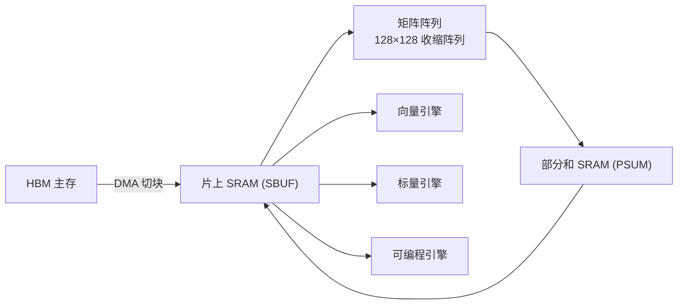
<sub>archetype A · 矩阵阵列中心：矩阵归阵列、其余归周边引擎，数据在 SRAM 与阵列间往返（AWS / Maia / Meta）</sub>

**B. tiled 众核 MIMD——Graphcore、Cerebras**

这两家放弃「一块大阵列」，改用**大量小核各自独立取指执行**：

- **Graphcore IPU GC200**：**1472 个 tile**，每 tile 一个多线程处理器（6 路 barrel threading）+ 624 KB 本地 SRAM + 独立地址空间，每 tile 每周期最多 64 个 MAC（AMP 单元）。关键是它**不是 SIMD**：tile 间只在同步点对齐，同步点之间各 tile 可跑不同代码，因此天然适合图、稀疏、不规则访问。
- **Cerebras WSE-3**：把众核推到极致——**90 万个核**铺满整片晶圆，每核仅 0.05 mm²、48 KB SRAM。核小到可以靠冗余核 + on-chip fabric 绕过制造缺陷，这是「整片晶圆当一颗芯片」能良率可行的根本前提。

两者都把「众多独立核 + 片上互联」当作一等结构，但 Graphcore 用**显式 BSP 同步**组织通信，Cerebras 用**数据到达即触发**（见 §2.3、§2.4）。

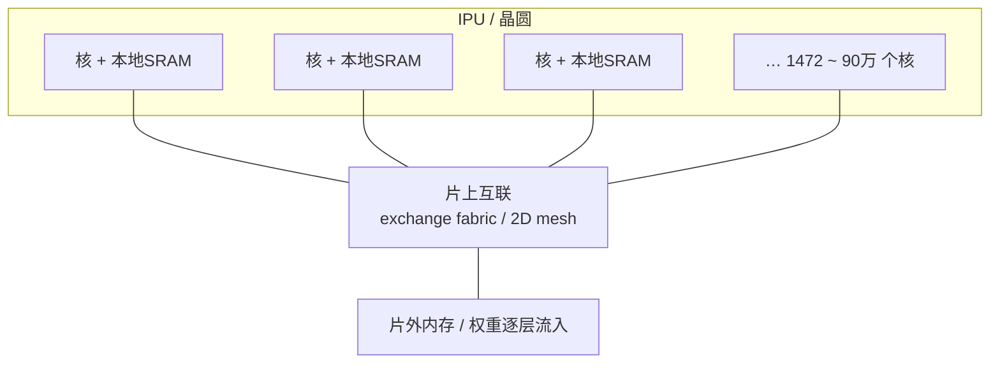
<sub>archetype B · tiled 众核 MIMD：大量独立小核各自取指执行，仅在同步点或数据流上对齐（Graphcore / Cerebras）</sub>

**C. 功能切片流式（functionally-sliced streaming）——Groq**

Groq TSP 是一个独特物种：它不把功能单元塞进核里，而是按**功能类型横向切片**铺在 2D 网格上——MXM（矩阵）、VXM（向量）、SXM（移位/转置）、MEM（SRAM）、ICU（指令控制）各占一组「列」。数据以**流（stream）**形式在芯片上东西向流动，每条 superlane 是横跨所有切片的一个截面（20 个 tile × 16 lane = 320 元素向量）。算子像传送带上的工位一样依次加工流过的数据。这种结构天然消除了「核内仲裁」，把整颗芯片变成一条可被编译器精确编排的大流水线。

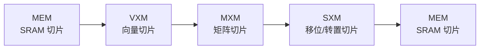
<sub>archetype C · 功能切片流式：功能单元按类型横向切片，数据以 stream 东西向流过、逐工位加工（Groq TSP）</sub>

**D. 可重构空间数据流（reconfigurable dataflow）——SambaNova**

SambaNova RDU 是最「软」的一类：芯片是一张由 **PCU（Pattern Compute Unit）** 和 **PMU（Pattern Memory Unit）** 交错排布、靠片上交换网络（RDN）连接的**可重构网格**。SN40L 每 socket 有 1040 PCU + 1040 PMU。关键在于 **PCU 本身可配置**——既能当输出固定的收缩阵列做矩阵乘，也能当多级 SIMD 流水做逐元素运算。编译器把整张算子图**空间展开**映射到这片 fabric 上，算子之间形成粗粒度流水级，数据在 PCU/PMU 间直接流动而不回主存（算子融合）。这是「用一片可重构硬件去贴合一张数据流图」的思路，灵活性最高，编译器负担也最重。

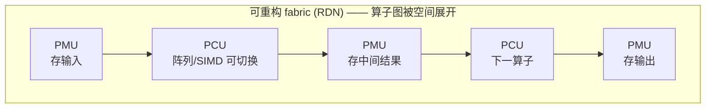
<sub>archetype D · 可重构空间数据流：PCU(算)与 PMU(存)交错成网，算子链直接在 fabric 上流水、不回主存（SambaNova RDU）</sub>

> **横向看点**：从 A 到 D，硬件越来越「软」、编译器责任越来越重、对 NVIDIA GPU 的差异化也越来越大。A 类（AWS/Maia/Meta）最容易工程落地、最像 TPU；D 类（SambaNova）与 B/C（Graphcore/Cerebras/Groq）则在赌「空间数据流 / 众核 / 确定性」能换来 GPU 给不了的效率或时延。

---

### 2.2 存储哲学：SRAM 即主存 vs HBM 即主存 vs 三层金字塔

这是这批架构**最分裂、也最能解释其系统形态**的一条轴。所有人都在对抗「内存墙」，但下注方向完全不同。

**路线一：片上 SRAM 即主存（去 HBM）——Cerebras、Groq、（Graphcore 半只脚）**

- **Cerebras**：**44 GB 片上 SRAM、21 PB/s 带宽**，芯片上**完全没有 HBM**。代价是单芯片放不下大模型权重，于是发明 **weight streaming**：权重存在片外 MemoryX（DRAM+闪存，最高 ~1.2 PB），由 **SwarmX** 广播 fabric 逐层流入；某一层流进来时，全部 90 万核处理这一层，激活留在片上，权重用完即弃，下一层再流入。它把「容量」外置、「带宽」内置，彻底回避了 HBM 带宽瓶颈。
- **Groq**：**~230 MB 片上 SRAM、80 TB/s**，同样**没有 DRAM**。后果是单颗芯片装不下大模型，必须用**几十上百颗芯片**把模型权重铺开常驻 SRAM。这正是 Groq 极高 token 速率与极低时延的物理来源（不必等 HBM），也是其「空间换时间」的本质代价。
- **Graphcore**：896 MiB 分布式片上 SRAM 作主工作存储，外部 DDR 被称为 **Streaming Memory**——tile 不能直接 load/store，必须显式 copy 进来。介于两条路线之间。

**路线二：HBM 即主存（经典 GPU/TPU 路线）——AWS、Maia、Meta**

- **AWS Trainium2**：96 GiB HBM、3 TB/s，配 28 MiB SBUF + 2 MiB PSUM 的软件管理 SRAM。
- **Maia 100**：64 GB HBM2E、1.8 TB/s，配约 500 MB 片上 SRAM。
- **Meta MTIA v2**：用更便宜的 **128 GB LPDDR5、204.8 GB/s**（而非 HBM）——这是为推荐模型「容量优先、带宽够用」量身定制的性价比选择，也是它能做到 ~90W 低功耗的原因之一。

**路线三：三层内存金字塔——SambaNova（独此一家）**

SN40L 同时上了三层：**520 MiB SRAM（数百 TB/s）+ 64 GiB HBM（~2 TB/s）+ 最高 1.5 TiB DDR（>200 GB/s/socket）**。这套设计直接服务于**超大模型 / 专家组合（Composition of Experts）**：路由权重放 HBM，非活跃专家权重放大容量 DDR，需要时以 >1 TB/s 把活跃专家搬进 HBM。官方称模型切换时延较 GPU 方案降低 15–31×。这是把「容量」和「带宽」分层解耦的典型工程。

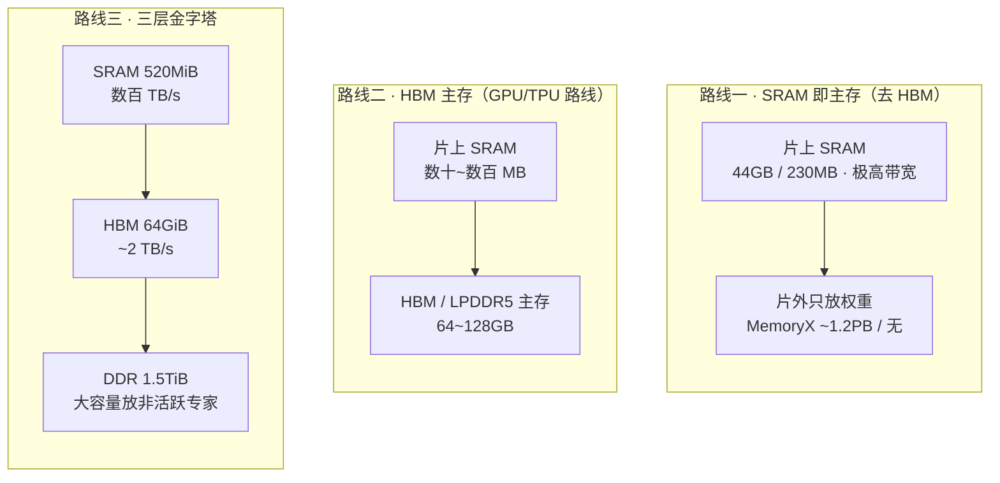
<sub>容量自上而下递增、带宽自上而下递减；路线一把容量外置、带宽内置，路线三把两者分层解耦</sub>

> **横向看点**：
> - **谁敢去 HBM**：只有把模型「铺」到很多芯片上的 Cerebras 和 Groq。它们用规模换掉了 HBM，但也因此**只有在大集群里才划算**。
> - **谁靠 HBM 单芯片自洽**：AWS/Maia 走主流稳妥路线。
> - **谁要同时吃下「超大容量 + 高带宽」**：SambaNova 用三层金字塔，针对 MoE/专家切换这一具体痛点。
> - **谁在省钱**：Meta 用 LPDDR5 替 HBM，是「够用就好」的内部 ASIC 思维。

---

### 2.3 执行时序：动态运行时 vs 编译期钉死（Program ↔ Model 谱系）

仓库里 Groq 那篇中文分析提出了一条极好的横向标尺：**「Program 驱动 ↔ Model/Graph 驱动」谱系**，以及推理场景下的核心诉求——**性能确定性**（给定模型、拓扑、负载，能否保证「每一次都在可预期的时间内完成」，而不仅是平均吞吐够高）。沿这条轴排，把「执行时序由谁决定、何时决定」摊开：

```
运行时动态决定 ◄──────────────────────────────► 编译期完全钉死
GPU 风格          AWS/Maia/Meta    Cerebras/SambaNova   Graphcore     Groq
(cache/乱序/调度)  (指令驱动+异步)    (数据触发数据流)      (静态BSP)    (cycle级静态)
```

- **Groq（最右、最极端）**：编译器**精确到周期**地安排每条指令和每个数据流的时序，使数据与指令在每个计算元件「在预定时刻相遇」。芯片上**没有 cache、没有乱序、没有动态仲裁**。好处是时延高度可预测（p99/p999 可控、可签 SLO）；代价是把全部复杂度压给编译器，且模型/拓扑一变就要重编。Groq 把 GPU 推理栈里大量「运行时不确定性源头」前移并固化到了编译期。
- **Graphcore（静态 BSP）**：执行节奏是严格的 **compute → sync → exchange** 三相循环。通信不是隐藏在 cache miss 之后的副作用，而是**可编译、可调度、可分析的显式阶段**。同步点全局对齐，因此整机行为高度可预测——这也是一种确定性，只是粒度比 Groq 粗（以同步步为单位）。
- **Cerebras / SambaNova（数据流触发）**：时序由**数据到达**驱动——数据来了就算，没数据就停。结构是编译期布好的，但触发是运行时的数据流。介于动态与静态之间。
- **AWS / Maia / Meta（指令驱动 + 异步）**：仍是较传统的「引擎执行指令 + DMA/信号量异步编排」，运行时有更多动态成分，更接近 GPU 的编程心智，工程上更稳妥但确定性弱于 Groq/Graphcore。

**控制流对比图（三种执行时序范式）**

Graphcore 的 BSP——计算与通信被切成严格的显式三相循环：

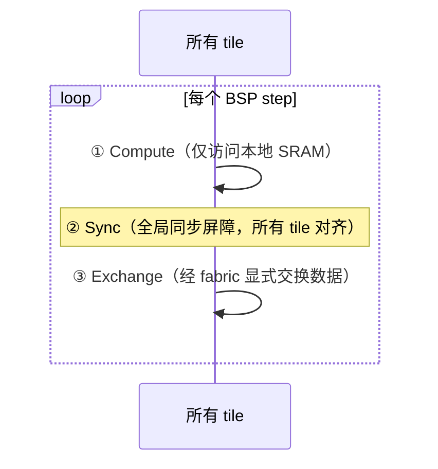

Groq 的 cycle 级静态调度——时序在编译期就排定，运行时无 cache / 无乱序 / 无仲裁：

```text
cycle :   t0       t1       t2       t3       t4
MXM   :  ─load──▶  MAC ───▶ MAC ───▶  …
VXM   :           ─────▶   act ───▶   …
SXM   :                    ─────▶   shift ─▶
        数据与指令在「预定时刻」于每个单元相遇 ⇒ 时延可预测（p99/p999 可控、可签 SLO）
```

Cerebras / SambaNova 的数据流触发——计算由数据到达驱动，0 权重直接被跳过：

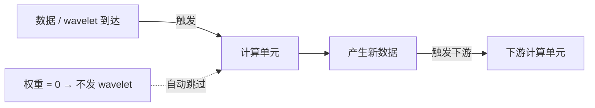

> **横向看点**：越往右（Groq、Graphcore），**编译器越重、运行时越「哑」、性能越可预测、灵活性越差**。这条轴几乎决定了一家方案是偏「推理 SLO」（要确定性，Groq）还是偏「通用可编程」（要灵活，AWS/Maia）。它和 §2.1 的「硬件软硬程度」不是一回事：SambaNova 硬件最「软」（可重构），但执行靠数据流触发而非 cycle 级静态调度。

---

### 2.4 数据流 vs 控制流：「数据触发计算」走了多远

与 §2.3 相关但正交的一条轴：**计算是被「指令」推动，还是被「数据」推动**。

- **纯数据流**：**Cerebras** 最典型——「数据到达即触发计算」（wavelet 触发）。一个直接红利是**非结构化稀疏**：若某权重为 0，就不发对应 wavelet，硬件自然跳过——这是 GPU 受限于 warp 难以做到的（GPU 需要结构化稀疏）。**SambaNova** 的算子图空间展开、数据在 PCU/PMU 间直接流动，也是数据流风格。
- **显式分相通信**：**Graphcore** 的 BSP 把「计算」和「通信」拆成显式阶段，通信经 exchange fabric，无队列、无仲裁、无 packet 开销，由编译器按时序和 select 状态搬数据——与传统 mesh/router/VC/credit-based NoC 截然不同。
- **流式传送带**：**Groq** 的 stream 模型，数据横向流过功能切片，每个切片选择「加工」或「放行」。
- **指令驱动**：**AWS/Maia/Meta** 仍以指令为主、DMA 为辅，数据流成分最弱。

> **横向看点**：数据流程度越高，越能利用**不规则/稀疏**结构（Cerebras 的非结构化稀疏、Graphcore 的图负载），但也越依赖编译器把数据布局和移动安排好。

---

### 2.5 互联与 Scale-out：模型怎么跨芯片铺开

由于多数厂商单芯片装不下大模型（尤其无 HBM 的 Cerebras/Groq），**scale-out 互联**几乎和片上架构同等重要。

| 厂商 | 片内互联 | 跨芯片 / Scale-out | 特点 |
| --- | --- | --- | --- |
| Cerebras | 全晶圆 2D mesh | SwarmX 广播 + MemoryX | 权重广播流入，单系统即「集群」 |
| Groq | superlane 东西向流 | Dragonfly（最高 10,440 TSP，任意两点 ≤5 跳） | 软件调度的确定性网络，编译器主动 push 数据 |
| Graphcore | exchange fabric | IPU-Link / GW-Link / IPU-Gateway | exchange 可扩展到多 IPU 的 tile |
| AWS | 片内 DMA fabric | NeuronLink-v3（×4） | 配 Trn2 UltraServer 做大集群 |
| Maia | 片内 fabric | 12× 400GbE，类 RoCE 协议 | 直接用以太网做后端网络，4800 Gbps 集合通信 |
| SambaNova | RDN 三维片上交换 | 多 socket 共享 DDR | 三层内存 + socket 间协作放专家 |
| Meta | 升级版 NoC | PCIe / 以太网 | 推荐推理多为数据并行，scale-out 压力较小 |

> **横向看点**：
> - **Groq 把网络也「确定性化」**——因为时延可预测，编译器能让第 2 颗芯片「在第 1 颗刚好要用数据时」提前把数据推过去，靠软件调度而非硬件反应式路由降时延。
> - **Cerebras 用广播代替全互联**——SwarmX 把权重一对多广播给众核，契合 weight streaming。
> - **Maia 直接押注以太网/RoCE**，符合它「Azure 数据中心原生」的定位。
> - 互联范式与片上范式高度一致：确定性架构（Groq）配确定性网络，BSP 架构（Graphcore）配可扩展 exchange。

---

### 2.6 编程模型与软件栈：编译器到底背多重

硬件越偏离 GPU，**软件栈的成熟度与编译器负担**就越成为成败关键。按「抽象层级 + 编译器责任」排：

- **低层 kernel 接口（贴近硬件、负担给开发者）**
  - **AWS NKI（Neuron Kernel Interface）**：仓库里那份《Architecture Guide for NKI》正是它——一套**tile 化、显式管理 SBUF/PSUM** 的 kernel 编程接口，开发者要理解 partition 维（映射到阵列行）/ free 维、收缩维对齐、DMA 转置开销等硬件细节。类似 Triton 之于 GPU，但更贴 Trainium 硬件。
  - **Graphcore Poplar / PopLibs**：用 C++ 直接构建 graph、variable、compute set、vertex、codelet，再由 Poplar 把全局程序 **lowering 成 per-tile 程序 + 显式 sync/exchange**。编译器要做 tile mapping、liveness 复用内存、exchange 调度——责任极重，大程序编译可达数分钟，需缓存编译结果。
- **图编译器（负担给编译器）**
  - **SambaNova SambaFlow**：把 PyTorch 算子图编译、空间映射到 PCU/PMU fabric，自动做算子融合、三层内存放置。编译器责任最重——既要切图又要布局又要管内存层级。
  - **Groq Compiler**：承担 cycle 级静态调度，是「确定性」的实现主体。
  - **Cerebras**：CSL/SDK + 图编译，负责把层映射到 90 万核并编排 weight streaming。
- **框架原生（负担给框架/最易用）**
  - **Meta MTIA**：**PyTorch 原生 + Triton-MTIA**，因为是内部芯片跑内部模型（推荐/排序），软硬协同设计，工具链最贴合自家 workload。
  - **Maia SDK / AWS Neuron SDK**：都提供 PyTorch/JAX 等框架接入，把多数复杂度藏在编译器后面。

**编程模型 / 编译链路图**

Graphcore Poplar——把全局图 lowering 成「显式 sync/exchange/compute」再到 per-tile 程序（编译器责任最显式）：

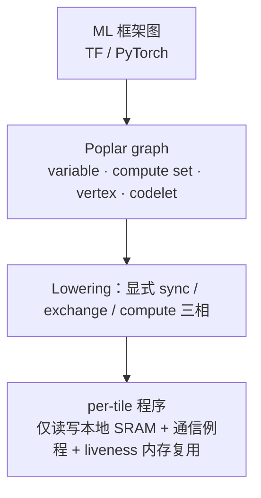

SambaNova SambaFlow——把算子图空间映射到 PCU/PMU 并做融合与三层内存放置（编译器责任最重）：

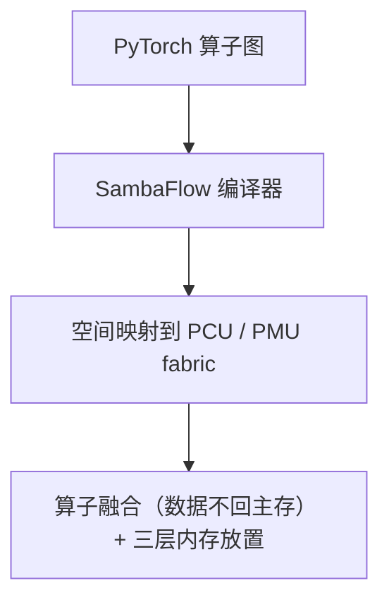

AWS NKI——tile 化、显式管理 SBUF/PSUM，partition 维对齐到阵列行（贴硬件的 kernel 编程）：

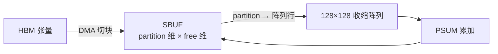

> **横向看点**：这是一条**残酷的隐形护城河轴**。硬件再好，编译器跟不上就发挥不出（Graphcore、SambaNova 的历史教训）。反过来，Meta/AWS 这类「自家芯片跑自家/客户负载」的玩家，靠**软硬协同 + 框架原生**降低了软件风险。NVIDIA 的真正壁垒（CUDA 生态）在这条轴上对所有人都是压力。

---

### 2.7 数制与稀疏：低精度与稀疏性的不同打法

| 厂商 | 低精度数制 | 稀疏支持 |
| --- | --- | --- |
| AWS Trainium2 | FP8（double-FP8 翻倍）、BF16/FP16、TF32、FP32、INT8/16/32 | 结构化稀疏（316 sparse TFLOPS/核） |
| Cerebras | FP16 为主 | **非结构化稀疏**（数据流天然支持，0 权重不发 wavelet） |
| Graphcore | FP32 / FP16，硬件 stochastic rounding | 面向不规则/稀疏访问的众核结构 |
| Groq | INT8 / FP16 | 靠静态调度，主打稠密低时延 |
| Meta MTIA v2 | 面向推荐的稠密+稀疏混合 | 稀疏算力较 v1 提升 **7×**（embedding/DLRM 关键） |
| Maia 100 | **MX 微缩放格式（4/6/9-bit）**、BF16、FP32 | DMA 支持多种 sharding |
| SambaNova | BF16 / FP32 / INT32 | 数据流融合 + bank 级并行 |

> **横向看点**：
> - **FP8/MX 微缩放**是新战场——AWS（double-FP8）、Maia（4/6/9-bit MX）都在押超低精度。
> - **非结构化稀疏**是数据流架构（Cerebras）相对 GPU 的独门优势。
> - **Meta** 的 7× 稀疏提升直指推荐模型的 embedding 查表，是 workload 定制的典型证据。
> - Graphcore 的**硬件随机舍入**是其面向训练数值稳定性的细节特色。

---

## 3. 逐厂商速写（锚点）

> 横向对比已在第 2 章展开，这里给每家一段定性速写，便于回查。

**AWS Trainium2 / NeuronCore-v3** — 云厂商自研的稳妥派。每芯 8 个 NeuronCore-v3，每核一块 128×128 收缩阵列 + Vector/Scalar/GpSimd 三引擎异构协作，96 GiB HBM + 软件管理的 SBUF/PSUM 两级 SRAM。v3 相对 v2 放宽了引擎并行访问 SBUF/PSUM 的限制、加了 DGE 动态生成 DMA 描述符等可编程性改进。NKI 提供贴硬件的 tile 化 kernel 编程。定位训练+推理通吃、以 TCO 对抗 NVIDIA。

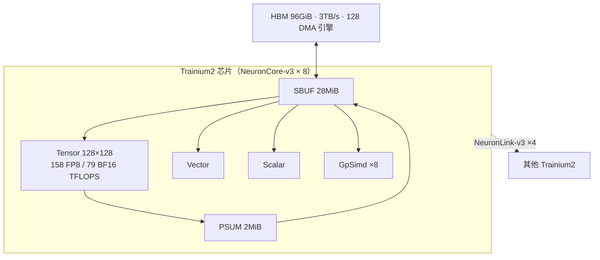

**Cerebras WSE-3** — 工程上最激进。整片晶圆（46,225 mm²、4 万亿晶体管、90 万核）当一颗芯片，44 GB 片上 SRAM、21 PB/s 带宽、无 HBM。靠 weight streaming（MemoryX 存权重、SwarmX 广播）破解「片上装不下大模型」，靠冗余核 + 绕障 fabric 破解良率，靠数据流触发拿到非结构化稀疏。单台 CS-3 ~23kW。主打超大模型训练与 HPC。

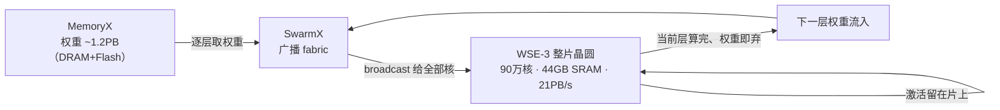
<sub>weight streaming：容量外置（MemoryX）、带宽内置（片上 SRAM），权重流过、激活常驻</sub>

**Graphcore IPU (Colossus Mk2 GC200)** — MIMD 众核 + BSP 的纯粹样本。1472 个独立多线程 tile、896 MiB 分布式 SRAM、显式 exchange fabric、外部 DDR 作 Streaming Memory。执行严格 compute→sync→exchange 三相，通信无队列/仲裁/packet 开销，全部由 Poplar 编译器静态编排。强在图与不规则/稀疏负载，弱在编译器复杂度与生态。仓库内已有一份非常详尽的 Poplar 编程模型 wiki。

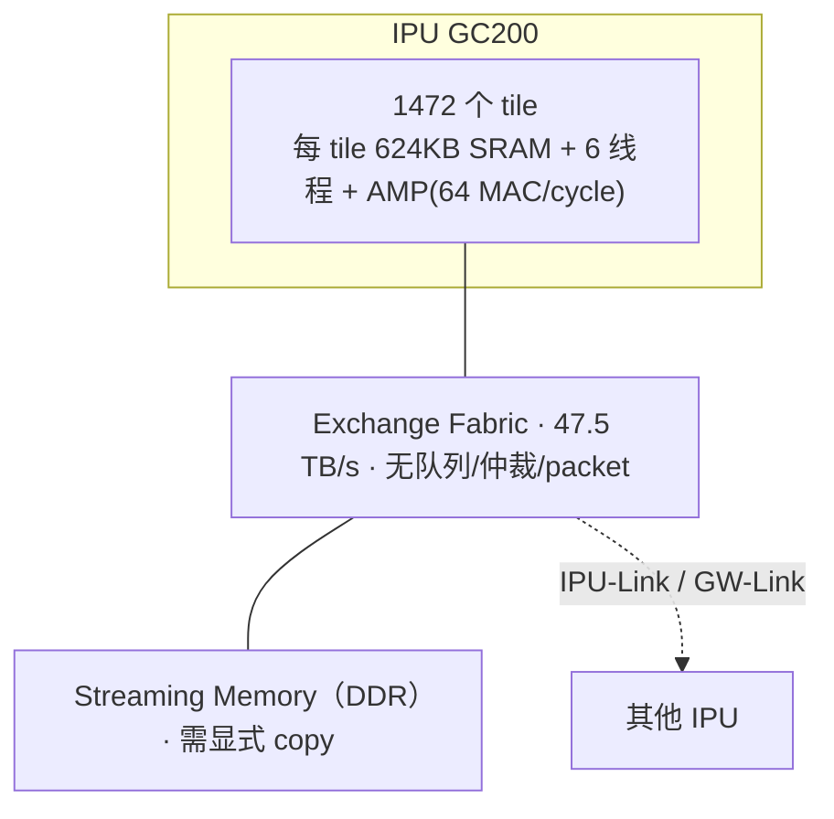
<sub>执行节奏：compute → sync → exchange（见 §2.3 BSP 时序图）</sub>

**Groq LPU / TSP** — 「性能确定性」的极端实践。功能切片（MXM/VXM/SXM/MEM）流式架构、~230 MB 片上 SRAM、无 DRAM、编译器 cycle 级静态调度、无 cache/无乱序。单芯片装不下大模型→靠几十上百颗芯片把权重铺在 SRAM 里换极低时延，Dragonfly 互联可扩到上万颗。是「空间换时间、把不确定性前移到编译期」的代表，专攻低时延 LLM 推理与可签 SLO 的场景。

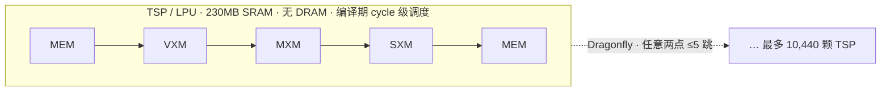
<sub>单芯片装不下大模型 → 用几十上百颗把权重铺满 SRAM 换极低时延（见 §2.3 Groq 时序表）</sub>

**Meta MTIA v2** — 性价比导向的内部 ASIC。8×8 PE 网格、256 MB 片上 SRAM、128 GB **LPDDR5（非 HBM）**、~90W，PyTorch 原生 + Triton-MTIA。专为 Meta 自家推荐/排序模型设计，v2 相对 v1 稠密算力 3.5×、稀疏 7×。软硬协同 + 自家负载使其工具链风险最低。不追求通用，只求把自家推理成本打下来。

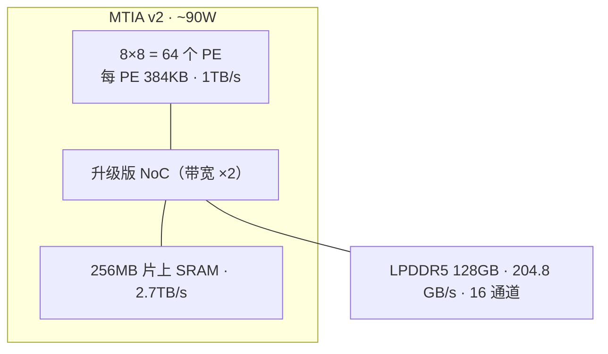
<sub>用 LPDDR5 替 HBM、面向推荐/排序（稀疏 embedding + 稠密 MLP），v2 稀疏算力较 v1 ×7</sub>

**Microsoft Maia 100** — Azure 原生云加速器。N5、105B 晶体管、~820 mm² reticle 上限大 die、16×R×16 张量单元 + 自定义 ISA 超标量向量、~500 MB SRAM、64 GB HBM2E/1.8 TB/s、支持 MX 微缩放格式。后端网络直接用 12× 400GbE + 类 RoCE，集合通信 4800 Gbps。500W（可到 700W）。定位为 Azure 自家负载（含大语言模型）做定制推理/训练。

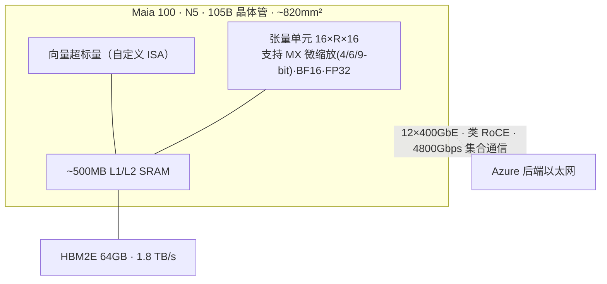

**SambaNova SN40L** — 可重构数据流 + 三层内存。5nm、2.5D CoWoS 双 die 芯粒、1040 PCU + 1040 PMU、638 BF16 TFLOPS/socket。PCU 可在「收缩阵列」与「SIMD 流水」间切换，算子图空间展开到 fabric 上做融合流水。三层内存（520 MiB SRAM + 64 GiB HBM + 1.5 TiB DDR）专为超大模型与**专家组合（Samba-CoE，150 个 7B 专家、合计万亿参数）**设计，专家切换时延较 GPU 降 15–31×。SambaFlow 编译器负担最重。

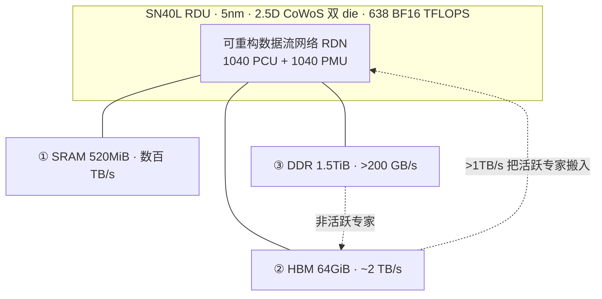
<sub>三层内存服务专家组合（Samba-CoE，150 个 7B 专家≈万亿参数）：路由权重在 HBM、冷专家在 DDR、热专家搬入算</sub>

---

## 4. 设计取舍总结与选型视角

### 4.1 三条根本取舍

1. **算力组织：固定阵列的「效率」 vs 可重构/众核的「灵活」**
   固定矩阵阵列（AWS/Maia/Meta）面积效率高、易落地，但只擅长规整稠密 matmul；众核（Graphcore/Cerebras）与可重构数据流（SambaNova）能吃不规则/稀疏/图，代价是编译器复杂度和面积/控制开销。

2. **存储：HBM 的「单芯片自洽」 vs SRAM 主存的「集群才划算」**
   HBM 路线（AWS/Maia）单芯片就能跑大模型，部署灵活；SRAM 主存路线（Cerebras/Groq）单芯片装不下，必须在大集群里把模型铺开，换来的是带宽/时延优势——**只有规模够大时才回本**。SambaNova 的三层金字塔是第三条路，专治超大模型容量。

3. **时序：确定性的「可签 SLO」 vs 动态的「通用易编程」**
   Groq/Graphcore 把时序前移到编译期，换确定性与可预测时延，代价是灵活性与编译成本；AWS/Maia 保留运行时动态，换通用性与工程稳妥。

### 4.2 谁适合什么（粗略映射）

| 需求 | 更契合的方案 | 原因 |
| --- | --- | --- |
| 极低时延、可签 SLO 的 LLM 在线推理 | **Groq** | cycle 级确定性 + SRAM 主存免等 HBM |
| 超大模型 / MoE / 专家组合 | **SambaNova**、**Cerebras** | 三层内存切换专家 / weight streaming 装下巨模型 |
| 大模型训练 + HPC | **Cerebras**、**Graphcore** | 众核 + 大片上 SRAM + 稀疏 |
| 训练推理通吃、要 TCO | **AWS Trainium2** | HBM 自洽 + 成熟 Neuron 栈 + 云规模 |
| 自家固定负载（推荐/排序、Azure 模型） | **Meta MTIA**、**Maia 100** | 软硬协同、性价比、框架原生 |
| 图 / 不规则 / 稀疏负载 | **Graphcore**、**Cerebras** | MIMD 众核 + 数据流天然支持非结构化稀疏 |

### 4.3 共同的敌人与共同的赌注

- **共同的敌人**：NVIDIA 的 HBM 带宽护城河 + CUDA 生态护城河。这 7 家的差异化都建立在「在某条轴上比 GPU 更激进」之上。
- **共同的赌注**：把更多复杂度从运行时**前移到编译期**。无论是 BSP、cycle 级静态调度、还是空间数据流映射，都是在赌「编译器能把硬件用满」。这条赌注的回报和风险，都集中在软件栈成熟度上（§2.6）。
- **共同的趋势**：推理与训练正分化为两套优化问题（仓库 Groq 中文分析的核心观察）。推理侧追求**确定性、性价比、可预测时延**，正是 Groq/Meta/Maia/SambaNova 的主战场；训练侧追求吞吐与规模，是 Cerebras/Graphcore/AWS 的舞台。

---

## 5. 给架构工程师的提炼结论

1. **「矩阵阵列 vs 众核 vs 数据流」不是优劣之分，而是对 workload 规整度的不同下注**。负载越规整稠密，固定阵列越赢；越不规则稀疏，众核/数据流越有机会。

2. **内存层级的选择几乎决定了系统形态**。去 HBM（Cerebras/Groq）意味着「单芯片 → 集群」的范式跃迁；三层金字塔（SambaNova）意味着为「容量 vs 带宽解耦」付出额外复杂度；LPDDR5（Meta）意味着对自家负载带宽需求的精确把握。先问「主存放哪」，再谈算力。

3. **确定性是推理时代的一等指标**。平均吞吐高不等于 p99/p999 可控。Groq 证明了「把时序前移到编译期」能换来可签 SLO 的确定性——这条经验对任何做推理基础设施的人都值得借鉴，哪怕不用 Groq 硬件。

4. **编译器是隐形胜负手**。硬件差异化越大，编译器责任越重、生态风险越高。Graphcore/SambaNova 的坎多在软件；Meta/AWS 的稳多来自软硬协同与框架原生。评估任何新架构，先评估它的编译栈成熟度。

5. **「软硬一体、自家负载」是穿越生态护城河的捷径**。Meta 和 Microsoft 不去做通用芯片，而是为确定的内部负载定制，把软件风险降到最低——这是非 NVIDIA 玩家最务实的一条路。

6. **这七家本质上是在同一张「设计空间地图」上选了不同坐标**：横轴是计算单元的软硬程度（固定阵列↔可重构数据流），纵轴是执行时序的静动程度（运行时动态↔编译期钉死），还有一条隐轴是主存位置（片上 SRAM↔HBM↔分层）。看懂这三条轴的坐标，就看懂了每一家的全部取舍。

---

## 附录 A：本仓库资料清单

| 厂商 | 仓库内资料 | 类型 |
| --- | --- | --- |
| AWS NeuronCore | `AWS-NeuronCore/Architecture_Guide_for_NKI.pdf` | 官方 NKI 架构指南 |
| Cerebras | `Cerebras/Cerebras_Architecture.pdf`、`Cerebras_Wafer-Scale_Architecture.pdf`、`HC2021/2022/2024.pdf` | 架构文档 + 三届 Hot Chips |
| Graphcore IPU | `Graphcore_IPU/IPU_Programmers_Guide_Wiki.md`（已整理）、`raw/` 下官方指南/HC2021/Graph Processor/微基准论文 | 官方文档 + HC + 第三方论文 + 已整理 wiki |
| Groq LPU | `Groq_LPU/tsp-isca20.pdf`（ISCA20）、`SDTSM.pdf`、`GROQ-ROCKS-NEURAL-NETWORKS.pdf`、`从 Groq 看…性能确定性….html`（中文分析） | 论文 + 中文系统分析 |
| Meta MTIA | `Meta_MTIA/MTIA_v2.pdf` | 架构资料 |
| Microsoft Maia | `Microsoft_Maia_100/MAIA100_HC2024.pdf` | Hot Chips 2024 |
| SambaNova | `SambaNova/HC2021_SN10.pdf`、`HC2024_SN40L.pdf`、`RDARuntime.pdf`、`Reconfigurable_Dataflow_Architecture.pdf`、`SambaNova_SN40L.pdf` | 两届 HC + RDA 白皮书 + 运行时 |

> Graphcore 部分本仓库已有一份高质量的《IPU Programmer's Guide Wiki》（`Graphcore_IPU/IPU_Programmers_Guide_Wiki.md`），含编程模型、BSP 执行语义、tile 内存细节、pipeline/recomputation 等深入内容，建议与本报告 §2 对照阅读。

## 附录 B：外部核对来源

- AWS：[Trainium2 Architecture Guide for NKI](https://awsdocs-neuron.readthedocs-hosted.com/en/latest/nki/guides/architecture/trainium2_arch.html)、[NeuronCore-v3 Architecture](https://awsdocs-neuron.readthedocs-hosted.com/en/latest/about-neuron/arch/neuron-hardware/neuron-core-v3.html)
- Cerebras：[Cerebras 官方 WSE-3 发布](https://www.cerebras.ai/press-release/cerebras-announces-third-generation-wafer-scale-engine)、[Tom's Hardware: 900,000-core 125 PFLOPS](https://www.tomshardware.com/tech-industry/artificial-intelligence/cerebras-launches-900000-core-125-petaflops-wafer-scale-processor-for-ai-theoretically-equivalent-to-about-62-nvidia-h100-gpus)
- Groq：[Groq ISCA 2020 TSP 论文](https://groq.com/groq-isca-paper-2020/)、[The Architecture of Groq's LPU](https://blog.codingconfessions.com/p/groq-lpu-design)
- Meta：[Our next generation MTIA (Meta AI Blog)](https://ai.meta.com/blog/next-generation-meta-training-inference-accelerator-AI-MTIA/)、[MTIA ISCA'25 paper](https://aisystemcodesign.github.io/papers/MTIA-ISCA25.pdf)
- Microsoft：[Inside Maia 100 (HC2024 PDF)](https://hc2024.hotchips.org/assets/program/conference/day2/81_HC2024.Microsoft.Xu.Ramakrishnan.final.v2.pdf)、[glennklockwood: Maia 100](https://www.glennklockwood.com/garden/processors/maia-100)
- SambaNova：[SN40L: Scaling the AI Memory Wall (arXiv 2405.07518)](https://arxiv.org/html/2405.07518v1)、[SN40L RDU (HC2024 PDF)](https://hc2024.hotchips.org/assets/program/conference/day1/48_HC2024.Sambanova.Prabhakar.final-withoutvideo.pdf)、[ServeTheHome: SN10 RDU](https://www.servethehome.com/sambanova-sn10-rdu-at-hot-chips-33/)

> 说明：外部来源用于核对公开参数；不同来源口径与代次可能存在差异，关键决策请回到附录 A 的原始 PDF 核对。
